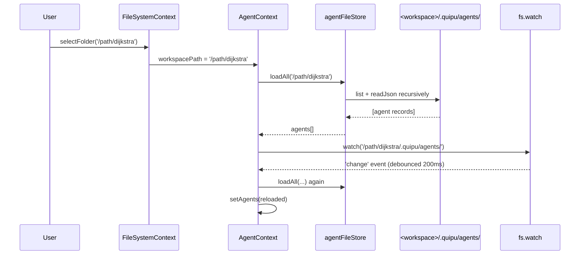

# File-based knowledge store — agents/repos/chats/folders as files in `.quipu/`, app state in `~/.quipu/`

## Overview

Replace the current JSON-blob storage model (everything mirrored into `~/.config/quipu_simple/quipu-state.json`) with a file-per-entity model. Agents, repo references, chats, and folder metadata live as individual JSON files inside `<workspace>/.quipu/`, mirroring the file-system tree directly so multi-level folders are real directories. App-global state (recent workspaces, last-opened workspace per window) moves to `~/.quipu/`. Chat session transcripts go to `~/.quipu/sessions-cache/` keyed by workspace path + agent slug — they're runtime cache, not knowledge content.

This is a fundamental architectural pivot. The previous workspace-scoped-keys plan (v0.22.0) and single-instance-lock plan (v0.23.0) both treated `quipu-state.json` as the source of truth and tried to defend it against races. That defense kept failing in subtle ways and just cost the user all their agents — the lesson is that the substrate itself is wrong for this kind of data. Per-entity files give us atomicity for free, plain-text debuggability, git-commitability of agent configs, and natural multi-level folders.

## Problem Frame

The shared JSON file has cost us:

- Inter-process write races that intermittently zeroed `recentWorkspaces` and corrupted workspace-scoped data (fixed in v0.23.0 with `requestSingleInstanceLock`, but the architectural fragility remained).
- Migration logic that, on a single failed `storage.set`, can wipe globals without the copy completing first.
- Opacity: a 200KB JSON file with N keys is hard to inspect, hard to back up, and impossible to reason about when something goes wrong.

The user's request: **make agents, chats, repos, and folder metadata live as files in the workspace's knowledge base**. Each entity becomes its own file. Folders become real directories. Multi-level folders fall out of the design naturally. Recent-workspaces and per-window state move to `~/.quipu/` — they're per-machine app state, not workspace content. Session transcripts go to `~/.quipu/sessions-cache/` because they're transient runtime data, not something a user wants to commit alongside source code.

This plan also recovers any data still present in the old `quipu-state.json` via a one-shot import that runs the first time each workspace is opened on the new build.

## Requirements Trace

- **R1.** Agents persist as one file per agent at `<workspace>/.quipu/agents/<folder-path>/<slug>.json`. Multi-level folders are real directories.
- **R2.** Repo references persist as one file per repo at `<workspace>/.quipu/repos/<folder-path>/<slug>.json`.
- **R3.** Chats are agents with `kind: 'chat'`. Same file layout, same persistence path.
- **R4.** Empty folders persist via a `.folder.json` marker file, so users can declare a folder before putting items in it.
- **R5.** Session transcripts persist as one file per agent at `~/.quipu/sessions-cache/<workspace-hash>/<agent-slug>.json`. Transcripts do NOT live in the workspace.
- **R6.** Recent workspaces persist at `~/.quipu/recent-workspaces.json` (per-window in-memory contract preserved — each window reads once on mount).
- **R7.** Last-opened workspace per window persists at `~/.quipu/window-state.json` so reopening Quipu restores the right workspace.
- **R8.** Two windows opening the same workspace see each other's agent/repo/folder mutations live, via a file watcher on `<workspace>/.quipu/`.
- **R9.** Filenames are human-readable slugs derived from the entity name (e.g., `frame-responder.json`, not `<uuid>.json`). Renaming the entity renames the file.
- **R10.** A one-shot migration on first launch reads any surviving data from `~/.config/quipu_simple/quipu-state.json` (workspace-scoped keys, then global keys as fallback) and writes it out as files. Migration is idempotent — running it twice is safe.
- **R11.** Browser mode (Vite dev or browser-only deployments) keeps working. Where the file system isn't available, the existing storage adapter is the fallback — but the renderer code path goes through a single service interface so callsites don't branch on runtime.

## Scope Boundaries

**In scope:**

- File-system service abstraction for read/write/list/delete/watch JSON files (Electron + browser parity).
- Slug generation utility with collision-handling and rename support.
- New `agentFileStore`, `repoFileStore`, `sessionCache` services that replace direct `storage.*` calls in `AgentContext` and `RepoContext`.
- Multi-level folder support: tree rendering in the Agents/Repos panels, drag-and-drop between any depths, recursive rename/delete.
- App-global state directory (`~/.quipu/`) with recent workspaces and per-window last-opened state.
- File watcher integration so the same workspace shared between windows updates live.
- One-shot import migration from the legacy `quipu-state.json` (both pre-v0.22.0 globals AND post-v0.22.0 workspace-scoped keys).
- Tab-path scheme update so reopening a chat tab references the agent file by its folder-relative slug, not a UUID.
- Removal of the now-unused `migration:agents-workspace-scoped:v1` flag, `agentsKey/agentSessionsKey/agentFoldersKey/reposKey` helpers, and the old workspaceKeysMigration utility (legacy code paths get deleted, not maintained alongside).

**Out of scope:**

- Cloud sync of `~/.quipu/` (it's per-machine, by design).
- Encryption of session-cache transcripts at rest.
- Concurrent same-workspace edits with conflict resolution (last-writer-wins per-file is enough — atomic at the file level).
- Browser-mode file watcher (browser localStorage doesn't watch; cross-tab updates can stay out of scope or use the existing `storage` event if trivial).
- Rebuilding existing tests for the legacy storage path — the entire `workspaceKeysMigration.test.ts`, `AgentContext.test.tsx`, `RepoContext.test.tsx` test files get replaced. We don't try to keep both code paths green.
- Any UI redesign for the agents/repos panels beyond what multi-level folders demand (recursive tree rendering with depth indentation).

## Context & Research

### Relevant code and patterns

- **Electron file IPC** — `electron/main.cjs:368-415` already has `read-directory`, `read-file`, `write-file`, `create-file`, `create-folder`, `delete-path`, `rename-path`, `path-exists`. These are the primitives. `watch-directory` and `watch-frame-directory` already exist for file change notifications.
- **Browser file IPC** — `server/main.go` exposes the same surface via REST. The `fileSystem` adapter at `src/services/fileSystem.ts` selects between Electron IPC and browser REST.
- **Existing path helpers** — `src/services/frameService.ts` is the closest analog: it stores per-source-file annotation JSON under `<workspace>/.quipu/meta/<path>.frame.json`. Multi-level folders inside `meta/` already work for FRAME — same model applies to agents/repos.
- **File watcher integration** — `electron/main.cjs:946-967` shows the pattern for watching a directory and broadcasting changes. The new agent/repo watchers slot in next to it.
- **Multi-window broadcast** — v0.23.0's `broadcast()` helper in `electron/main.cjs:118-126` already routes `frame-changed` events to all windows. The new `agent-files-changed` event uses the same channel.
- **Drag-and-drop in panels** — `src/extensions/agents-panel/` and `src/extensions/repos-panel/` already implement single-level folder DnD. Recursive tree rendering needs depth-aware drop targets.
- **Slug normalization precedent** — `src/context/RepoContext.tsx:33-39` has `sanitizeRepoName` for the on-disk clone directory. The new slug helper generalizes this pattern.

### Institutional learnings

- `docs/plans/2026-04-28-001-feat-workspace-scoped-agent-data-plan.md` (v0.22.0) introduced the workspace-scoped JSON keys. That plan's foundation gets removed by this one — `agentsKey/agentSessionsKey/agentFoldersKey/reposKey` and the `workspaceKeysMigration` utility all delete.
- The v0.23.0 single-instance lock + multi-window broadcast plumbing stays — file watching needs broadcast-to-all-windows just like FRAME watching does.
- The v0.21.0 chat session shape (`AgentSession.messages`) is unchanged. Only the persistence location moves.

### External references

None warranted — this is local-fs primitives + plain JSON files. Electron's `fs.watch` is well-understood; we already use it for FRAME.

## Key Technical Decisions

- **An entity's "ID" is its folder-relative path.** No more UUIDs. An agent at `<workspace>/.quipu/agents/research/web-scraping/foo.json` has id `research/web-scraping/foo`. The agent's `folder` field is `research/web-scraping`, slug is `foo`. `id = folder + '/' + slug` (or just `slug` at root). Tab paths become `agent://<id>`. Rationale: removes a layer of indirection, makes file ↔ entity mapping unambiguous, and means renaming OR moving the agent updates everywhere by virtue of tab-path lookups going through the same id resolver.
- **Slug generation: lowercase kebab-case from the entity's name, with** `-2`**/**`-3` **suffixes on collision within the same folder.** Empty/punctuation-only names fall back to `chat` or `agent` as the base. Max 64 chars. Rationale: matches `sanitizeRepoName` precedent and FRAME path conventions; readable for humans browsing the directory.
- **Folder paths are forward-slash separated, no** `..`**, no leading/trailing slash.** Stored canonically inside the JSON. The on-disk separator is OS-native; the in-memory form is always `/`. Rationale: portability across OSes; security (no path escapes).
- **Empty folders use a** `.folder.json` **marker file** (with optional metadata fields like `displayName` for capitalization that doesn't survive slugification). Rationale: preserves declared folders without items; allows future folder metadata; survives `git clean` when committed.
- **Sessions live in** `~/.quipu/sessions-cache/<workspace-hash>/<agent-id-with-folder>.json` where workspace-hash is a SHA-1 of the absolute workspace path (truncated to 12 chars) plus a manifest entry mapping hash → path for inspection. Rationale: stable directory name independent of the workspace's actual filesystem path (which can be long); keeps the cache out of the user's workspace tree; one file per agent so writes don't grow JSON-blob style.
- **One-shot legacy import runs at workspace-open, not at app start.** When a workspace opens for the first time on the new build, check if the legacy `quipu-state.json` has `agents:<this-workspace>`, `repos:<this-workspace>`, etc. — if yes, import them as files. As fallback, if pre-v0.22.0 globals (`agents`, `repos`, etc.) still exist AND no other workspace has imported them yet, this workspace claims them. After import succeeds for a key, that key is deleted from the legacy file. Rationale: the user explicitly chose "first opened workspace claims globals" in the previous design; preserves that. Per-workspace import key (e.g., `agents:<path>`) deletes after copy succeeds, so re-imports don't double-add.
- **File watcher debounces by 200ms** before reloading, because rename ops fire `delete` + `create` in quick succession. Rationale: avoids flicker; matches the FRAME watcher's debounce behavior.
- **Renames atomically: write the new file first, then delete the old one.** A power-loss between the two steps leaves duplicate files (recoverable) instead of zero files (lost). Rationale: the data-loss incident this plan responds to was caused by exactly the wrong order — clear-before-copy. Never again.

## Open Questions

### Resolved during planning

- **File layout per workspace** — confirmed: `agents/`, `repos/`, `sessions/` (none in workspace; sessions go to `~/.quipu/sessions-cache/`).
- **Sessions location** — `~/.quipu/sessions-cache/` (option c). Confirmed by user.
- **Recent workspaces scope** — per-window. Same as v0.22.0.
- **Live cross-window updates within one workspace** — yes, via fs.watch on `<workspace>/.quipu/`.
- **Slugs vs UUIDs** — slugs. User-confirmed.
- **Multi-level folders** — yes. Confirmed by user.

### Deferred to implementation

- **Slug collision policy when an agent renames into a name that conflicts with a sibling.** Probably append `-2` and surface a toast. Confirm at implementation.
- **Whether to preserve sessions across an agent rename.** The id changes when the slug changes. Either: rename the session-cache file along with the agent file, or invalidate the old cache and start fresh. I'll default to renaming both atomically.
- **Whether to GC orphaned session-cache files when their agent is deleted.** Yes, in `deleteAgent`. Confirm not breaking anything.
- **Whether the file watcher should reload only the affected entity, or rescan the whole directory.** Start with full rescan (simpler, debounced) and optimize if it becomes a perf issue.
- **Whether to commit** `.quipu/agents/` **and** `.quipu/repos/` **by default.** The user said "knowledge base" framing, so probably yes. We update `.gitignore` defaults to exclude `tmp/` (already exists) but NOT `.quipu/`. Sessions live in `~/.quipu/sessions-cache/` so they're never committed.
- **Whether to expose a** `~/.quipu/state.json` **schema for plugins to extend.** Out of scope; defer.

## High-Level Technical Design

### File layout

```
<workspace>/
  .quipu/
    meta/                          # already exists (FRAME annotations)
    agents/                        # NEW
      .folder.json                 # optional, empty-root marker (rare)
      research/                    # multi-level folder = real directory
        .folder.json               # marks the folder as declared
        web-scraping/
          .folder.json
          foo.json                 # agent slug=foo, folder=research/web-scraping, id=research/web-scraping/foo
      frame-responder.json         # agent at root, slug=frame-responder, id=frame-responder
    repos/                         # NEW
      quipu-self.json
      external/
        upstream-repo.json
    # NOTE: sessions/ is NOT here. Sessions live in ~/.quipu/sessions-cache/.

~/.quipu/
  recent-workspaces.json           # NEW (was: quipu-state.json::recentWorkspaces)
  window-state.json                # NEW (last-opened workspace per window)
  sessions-cache/                  # NEW
    <workspace-hash>/              # SHA-1[:12] of absolute workspace path
      manifest.json                # { "<hash>": "/abs/workspace/path" } — for human inspection
      research/
        web-scraping/
          foo.json                 # full transcript for agent at id research/web-scraping/foo
      frame-responder.json
  plugins.json                     # already exists, untouched
  plugins/                         # already exists, untouched

# Legacy (will be drained by the one-shot import then deleted):
~/.config/quipu_simple/
  quipu-state.json                 # whatever survives, drained per-workspace
```

### Agent file schema

```json
{
  "schemaVersion": 1,
  "name": "FRAME Responder",
  "slug": "frame-responder",
  "folder": "research/web-scraping",
  "kind": "chat",
  "systemPrompt": "...",
  "model": "claude-sonnet-4-5",
  "bindings": [...],
  "permissionMode": "default",
  "allowedTools": null,
  "createdAt": "2026-04-30T10:00:00Z",
  "updatedAt": "2026-04-30T10:05:00Z",
  "claudeSessionId": "..."
}
```

`id = folder ? `${folder}/${slug}` : slug`. Computed at load, never stored — derived from filename and parent directory.

### Folder marker schema

```json
{
  "schemaVersion": 1,
  "displayName": "Research / Web Scraping",
  "createdAt": "2026-04-30T10:00:00Z"
}
```

Optional file. Absent files = folder still exists if at least one entity lives in it.

### Renderer state lifecycle



### Slug generation

```text
slugify("FRAME Responder")           -> "frame-responder"
slugify("New chat")                  -> "new-chat"
slugify("Iago's bot — v2!")          -> "iagos-bot-v2"
slugify("")                          -> "chat" (kind-based default)
disambiguate("foo", existing=["foo", "foo-2"]) -> "foo-3"
```

## Implementation Units

- \[x\] **Unit 1: Slug helper + path utils**

**Goal:** Pure utility module for slugifying names, normalizing folder paths, and disambiguating collisions.

**Files:**

- Create: `src/services/slug.ts` — `slugify(name, fallback)`, `normalizeFolder(folder)`, `disambiguateSlug(base, existing)`, `joinId(folder, slug)`, `splitId(id) -> { folder, slug }`.
- Test: `src/__tests__/slug.test.ts`.

**Approach:**

- ASCII-fold and lowercase, replace non-alphanumeric runs with `-`, trim leading/trailing dashes, cap at 64 chars.
- Reject `..` and absolute paths in folder normalization. Forbid leading/trailing slashes. Always forward-slash.
- Disambiguator returns the base if free, else `base-2`, `base-3`, etc.
- `splitId('research/web-scraping/foo')` → `{ folder: 'research/web-scraping', slug: 'foo' }`. `splitId('foo')` → `{ folder: '', slug: 'foo' }`.

**Test scenarios:**

- Happy path: simple name → expected slug.
- Edge cases: empty name (returns fallback), all-punctuation, unicode (transliteration acceptable, fallback to fallback if produces empty), 100-char name (capped), names with leading/trailing whitespace, names with internal multiple spaces.
- Disambiguation: empty existing list → base unchanged; base in existing → suffix; base + base-2 in existing → base-3.
- Folder normalization: rejects `../foo`, `/foo`, `foo/`, `foo//bar`. Accepts `foo/bar/baz`. Empty string accepted (root).
- Round-trip: `joinId(splitId(x))` for various x.

**Verification:**

- All scenarios pass via unit tests; no other code in the codebase needs to change at this point.

---

- \[x\] **Unit 2: File-store primitives**

**Goal:** A thin service that reads, writes, lists, and deletes JSON files in a workspace's `.quipu/` subtree, plus a watcher that emits change events. Dual-runtime through the existing `fileSystem` adapter.

**Files:**

- Create: `src/services/quipuFileStore.ts` — `readJsonFile<T>(absPath)`, `writeJsonFile(absPath, data)` (atomic via tmp + rename), `deleteFile(absPath)`, `listJsonFilesRecursive(absDir)`, `ensureDir(absDir)`, `watchDirRecursive(absDir, onChange)` (debounced 200ms).
- Test: `src/__tests__/quipuFileStore.test.ts` (uses a tmp directory in vitest).

**Approach:**

- Atomic write: write to `<file>.tmp`, then `fs.renamePath(<file>.tmp, <file>)`. Rename is atomic on the same filesystem.
- `listJsonFilesRecursive` returns relative paths from the root, excluding `.folder.json` markers.
- Watch: prefer the existing `watch-directory` IPC if available; otherwise fall back to polling.

**Test scenarios:**

- Happy path: write a JSON file, list the dir, read it back, delete it.
- Edge case: read non-existent file returns null.
- Edge case: write to a path whose parent dir doesn't exist auto-creates the dir.
- Edge case: list a non-existent dir returns `[]`.
- Edge case: atomic write doesn't leave a `.tmp` file on success.
- Error path: writeJsonFile fails halfway (mock fs.rename to throw) — tmp file is cleaned up.
- Integration: write file A, watcher fires within 300ms with A's path.

**Verification:**

- Tests pass against a real tmp directory.
- No callsite changes yet — Units 3+ consume this.

---

- \[x\] **Unit 3: agentFileStore service**

**Goal:** Domain service for agents — load all, save one, delete one, rename, plus folder operations. Built on Unit 2's primitives.

**Files:**

- Create: `src/services/agentFileStore.ts`.
- Test: `src/__tests__/agentFileStore.test.ts`.

**Approach:**

- `loadAllAgents(workspacePath): Promise<Agent[]>` — recurses `<workspace>/.quipu/agents/`, parses each `*.json`, attaches the derived `id` (from filename + folder).
- `loadAllFolders(workspacePath): Promise<FolderNode[]>` — same recursion but collects `.folder.json` markers + dirs.
- `saveAgent(workspacePath, agent)` — write to `<folder>/<slug>.json`. If `slug` or `folder` changed since last load, also delete the old file.
- `deleteAgent(workspacePath, id)` — delete the file. Caller decides whether to delete the session cache too.
- `renameFolder(workspacePath, kind, oldPath, newPath)` — `fs.renamePath` the directory. Children's folder field updates implicitly (no JSON edits needed since folder is derived from path).
- `deleteFolder(workspacePath, kind, path, options)` — recursive delete or move-children-up depending on options.

**Test scenarios:**

- Happy path: write 2 agents in different folders, loadAll returns both with correct ids and folders.
- Edge case: agent in root (folder = ''), agent in nested folder, mixed.
- Edge case: rename agent (slug change) deletes old file and writes new.
- Edge case: move agent (folder change) deletes old, writes to new dir.
- Edge case: delete agent in nested folder doesn't break sibling agents.
- Edge case: empty folder declared via `.folder.json` is loaded and exposed in folders list.
- Edge case: renameFolder moves all children to the new path, all loadable afterwards.
- Edge case: deleteFolder with `recursive: true` removes all children; without, moves children to parent.
- Error path: `.quipu/agents/` doesn't exist on first load — return empty list, don't crash.

**Verification:**

- Tests use real tmp dirs.

---

- \[x\] **Unit 4: repoFileStore service**

**Goal:** Same shape as Unit 3 for repos.

**Files:**

- Create: `src/services/repoFileStore.ts`.
- Test: `src/__tests__/repoFileStore.test.ts`.

**Approach:** Mirror Unit 3.

**Test scenarios:** Same shape as Unit 3, scoped to repos.

**Verification:** Tests pass.

---

- \[x\] **Unit 5: sessionCache service**

**Goal:** Persist chat transcripts in `~/.quipu/sessions-cache/<workspace-hash>/<agent-id>.json`.

**Files:**

- Create: `src/services/sessionCache.ts`.
- Test: `src/__tests__/sessionCache.test.ts`.

**Approach:**

- `workspaceHash(absPath)` — SHA-1\[:12\] of the absolute path. Cached.
- `loadSession(workspacePath, agentId)` → `AgentSession | null`.
- `saveSession(workspacePath, agentId, session)` — atomic write.
- `deleteSession(workspacePath, agentId)` — delete file (idempotent).
- `renameSession(workspacePath, oldAgentId, newAgentId)` — for slug renames.
- Maintain `~/.quipu/sessions-cache/<hash>/manifest.json` mapping hash → workspace path (only for human inspection — code never reads it back).
- Save is debounced \~500ms inside the caller (AgentContext) to avoid disk thrash on token-by-token streaming.

**Test scenarios:**

- Happy path: save session, load it, equal.
- Edge case: same agent id in two different workspaces → two different cache files.
- Edge case: delete session is a no-op if no file.
- Edge case: rename session moves the file.
- Edge case: load non-existent session returns null.

**Verification:** Tests pass.

---

- \[x\] **Unit 6: AgentContext refactor**

**Goal:** Replace all `storage.get/set` calls in `AgentContext` with `agentFileStore` + `sessionCache` calls. Drop the `loadedWorkspaceRef` barrier and the workspaceKeysMigration call (file-based loads don't have the same race). Keep workspace-aware load lifecycle. Hook up the file watcher.

**Files:**

- Modify: `src/context/AgentContext.tsx`.
- Replace: `src/__tests__/AgentContext.test.tsx`, `src/__tests__/AgentContext.drafts.test.tsx`, `src/__tests__/AgentContext.resumeSession.test.tsx`, `src/__tests__/AgentContext.respondToPermission.test.tsx`. Old tests target the storage-key path that's going away.

**Approach:**

- `useEffect([workspacePath])` calls `agentFileStore.loadAllAgents(workspacePath)` and `agentFileStore.loadAllFolders(workspacePath)`.
- `upsertAgent(agent)` writes to disk via `agentFileStore.saveAgent(workspacePath, agent)`. State update follows.
- `deleteAgent(id)` calls `agentFileStore.deleteAgent` AND `sessionCache.deleteSession`.
- Folder ops dispatch to `agentFileStore.renameFolder/deleteFolder/createFolder`.
- Sessions: when a turn produces messages, debounced `sessionCache.saveSession`. On agent open, `sessionCache.loadSession` populates state.
- File watcher: subscribe in the workspace effect, reload on debounced change events. On unmount or workspace change, unsubscribe.
- Drafts ref + `getDraft/setDraft` API unchanged — they're in-memory only.
- `resumeSession` unchanged.
- `respondToPermission` unchanged.

**Test scenarios:**

- Happy path: provider mounts with `workspacePath = '/foo'`, files exist, state populates.
- Happy path: `upsertAgent` writes a file, file watcher observes the same change without infinite loop (echo suppression).
- Edge case: rename agent (slug derivation changes) updates the file on disk and the in-memory id.
- Edge case: workspace switch drops the watcher and creates a new one for the new workspace.
- Edge case: another window writes a new agent file → this window's watcher fires → state reloads.
- Integration: rename folder containing 3 agents → all 3 agents' ids update, files moved, state reflects.
- Integration: send a message → session cache file written within 1s, transcript present after restart.

**Verification:**

- Tests pass.
- Manually: open a workspace, create an agent, the `<workspace>/.quipu/agents/<slug>.json` file appears.
- Manually: open the same workspace in a second window, both see the agent immediately.

---

- \[x\] **Unit 7: RepoContext refactor**

**Goal:** Same as Unit 6, scoped to repos.

**Files:**

- Modify: `src/context/RepoContext.tsx`.
- Replace: `src/__tests__/RepoContext.test.tsx`.

**Approach:** Mirror Unit 6.

**Test scenarios:** Same shape, scoped to repos.

**Verification:** Tests pass.

---

- \[x\] **Unit 8: FileSystemContext — recentWorkspaces moves to** `~/.quipu/`

**Goal:** Recent-workspaces and last-opened state move from `quipu-state.json` to `~/.quipu/recent-workspaces.json` and `~/.quipu/window-state.json`. Per-window in-memory contract preserved.

**Files:**

- Modify: `src/context/FileSystemContext.tsx`.
- Create: `src/services/appConfigStore.ts` — thin wrappers `loadRecentWorkspaces()`, `saveRecentWorkspaces(list)`, `loadLastOpenedWorkspace()`, `saveLastOpenedWorkspace(path)`. Pure file IO via `quipuFileStore` from Unit 2.
- Modify: `src/__tests__/FileSystemContext.recentWorkspaces.test.tsx`.

**Approach:**

- `appConfigStore` resolves `~` via the existing `electronAPI.getHomeDir` (or `os.homedir()` in main).
- Path resolution is cached at first call.
- Browser mode falls back to `localStorage` with the same key shape (no fs available).
- The mount-effect reads from the new location; the storage-set callsites move accordingly.
- Per-window contract preserved: read once on mount, never read again, writes only.

**Test scenarios:** Mirror existing recentWorkspaces tests against the new store.

**Verification:** Tests pass; on mount, `~/.quipu/recent-workspaces.json` is created if missing.

---

- \[x\] **Unit 9: Multi-level folder UI**

**Goal:** Recursive tree rendering in the Agents and Repos panels. Drag-and-drop between any folder depths.

**Files:**

- Modify: `src/extensions/agents-panel/<panel files>` (read first to find them).
- Modify: `src/extensions/repos-panel/<panel files>`.
- Tests: extend or create renderer tests.

**Approach:**

- Recursive component: render folder header + children (recurse). Track depth for indent styling.
- DnD drop targets at every folder header (not just root and explicit folders).
- Folder rename: edit-in-place, dispatches to `renameFolder` on the appropriate context.
- Folder create: at any depth via right-click → "New folder here".
- Folder delete: confirmation dialog, dispatches to `deleteFolder`.
- Empty folders show a "drop items here" hint.

**Test scenarios:**

- Happy path: 2-deep nesting renders with correct indent.
- DnD: drag agent from `research/` to `research/web-scraping/` updates folder, file moves.
- Folder create: at root, at nested.
- Folder rename: doesn't break in-flight tabs (tab path updates).
- Folder delete with `recursive: true`: all children removed.

**Verification:** Manual UI testing on both panels.

---

- \[ \] **Unit 10: One-shot import from legacy** `quipu-state.json`

**Goal:** When a workspace opens for the first time on the new build, drain whatever data still lives in the legacy storage file into files. Idempotent.

**Files:**

- Create: `src/services/legacyImport.ts` — `importLegacyDataForWorkspace(workspacePath): Promise<{ imported: number, errors: number }>`.
- Test: `src/__tests__/legacyImport.test.ts`.
- Wire: call from `AgentContext` and `RepoContext` workspace-open effect once per workspace per launch.

**Approach:**

- Track import state in `~/.quipu/import-state.json` keyed by absolute workspace path → `{ importedAt: ISO }`. Set after successful import.
- Read order: prefer `agents:<workspacePath>` (post-v0.22.0 scoped key); fall back to global `agents` AND set a "globals-claimed" marker so a second workspace doesn't re-import them.
- For each entity in the source:
  1. Generate a slug from name (Unit 1).
  2. Disambiguate against existing files in the destination dir.
  3. Write the file (Unit 2, atomic).
  4. ONLY after write succeeds, remove the source key from `quipu-state.json`.
- If any single entity fails, log + continue with the next; failed entities are NOT removed from the source so retry is possible.
- Sessions migrate to `~/.quipu/sessions-cache/<workspace-hash>/<slug>.json` similarly.

**Test scenarios:**

- Happy path: legacy file has `agents:<wp>` with 3 agents → 3 files appear, key removed.
- Happy path: legacy file has only global `agents` with 5 agents, this workspace claims them, a second workspace's import is a no-op.
- Edge case: legacy file empty/missing → no-op, mark imported.
- Edge case: import already ran for this workspace → no-op fast path.
- Error path: writing one file fails → other files still imported, source key still has the failed entity for retry.
- Integration: post-import, AgentContext loads the same agents from the new file location.

**Verification:**

- Manual: with the user's existing `quipu-state.json` backup, run the import and confirm files appear.
- The user's lost agents recovery hinges on this unit working correctly.

---

- \[ \] **Unit 11: Tab-path / id migration**

**Goal:** Tab paths previously used `agent://<uuid>`. New scheme is `agent://<id>` where `id` is the folder-relative slug-path. Migrate any persisted session restore data.

**Files:**

- Modify: `src/types/tab.ts` (no schema change, but doc comment updated).
- Modify: any callsite that does `tab.path.replace(/^agent:\/\//, '')` (mainly `ChatView.tsx`).
- Modify: tab session restore path in `WorkspaceContext.tsx` that hydrates open agent tabs.

**Approach:**

- Tab persistence already stores `tab.path`. After import, old tabs still reference UUIDs that no longer exist as files. On hydrate, look up by old id; if not found, log + drop the tab. Don't hard-fail.

**Test scenarios:**

- Happy path: open chat, close, reopen Quipu — chat tab restores via slug-based id.
- Edge case: persisted tab references stale UUID → tab doesn't reopen, no crash, no error toast.

**Verification:** Manual restart cycle.

---

- \[ \] **Unit 12: Cleanup of legacy storage helpers**

**Goal:** Delete the workspace-scoped storage helpers and their tests now that they're unused.

**Files:**

- Delete: `src/services/workspaceKeys.ts`, `src/services/workspaceKeysMigration.ts`, `src/__tests__/workspaceKeysMigration.test.ts`.
- Verify: no remaining imports of the deleted files (grep + tsc).

**Approach:** rm + verify.

**Test scenarios:** Full vitest suite passes after deletion.

**Verification:** `tsc --noEmit` clean, all tests green.

## System-Wide Impact

- **Interaction graph:** AgentContext and RepoContext now have file-watcher subscriptions that fire on any change to the `.quipu/` subtree. The watcher debouncer is the bottleneck on rapid mutations.
- **Error propagation:** File-system errors (permissions, ENOSPC) now surface to the user via `showToast`. Today's storage failures were silent.
- **State lifecycle risks:** Two windows in the same workspace can both write to the same file (race), but each entity is its own file so the blast radius is one entity at a time, not the whole array. Last-writer-wins per-file. Acceptable per scope.
- **API surface parity:** `AgentContextValue` and `RepoContextValue` keep the same public methods. Only their internals change. ChatView and the panels don't need to know.
- **Integration coverage:** the import path is the highest-risk surface. Test it with the user's actual backup file before declaring done.
- **Unchanged invariants:**
  - Single-instance lock from v0.23.0 stays.
  - Multi-window broadcast helpers in `electron/main.cjs` stay.
  - The Claude Code CLI subprocess contract is unchanged.
  - Tab restore via `session:<workspacePath>` storage key is unchanged.
  - Browser-mode REST API in `server/main.go` is unchanged (it already exposes the file primitives).

## Risks & Dependencies

| Risk | Mitigation |
| --- | --- |
| Import bug loses data again. | Atomic writes only delete source keys after destination write succeeds. Backup the legacy file before importing (copy `quipu-state.json` to `quipu-state.json.pre-import.<timestamp>` on first import). Tests cover the failure path explicitly. |
| File watcher fires for our own writes (echo storm). | Suppress events for \~300ms after our own write by tracking pending paths; or use mtime-comparison to ignore no-op reloads. |
| Multi-level folder rename causes tab paths to go stale mid-render. | After a folder rename, walk all open tabs and update paths whose prefix matches. |
| `~/.quipu/` doesn't exist or isn't writable. | Auto-create with mkdir-p on first write; if the create fails (permission), fall back to `~/.config/quipu_simple/` legacy storage and surface a toast. |
| Slug collision after rename. | Disambiguator guarantees uniqueness within a folder. Test covers it. |
| Browser mode regression. | The fileSystem adapter already serves the browser path. Smoke test browser mode with `npm run dev` after each unit. |

## Documentation / Operational Notes

- Update `CLAUDE.md` State Management section to reflect the new persistence model (files in `.quipu/`, app config in `~/.quipu/`).
- Add a `docs/solutions/` learning entry: "JSON-blob storage was the wrong substrate for multi-entity, multi-window app state — files give you atomic locking and human-readable persistence for free."
- Bump `package.json` to `0.24.0` (significant change).
- Release notes call out: agents/repos/chats now persist as files in `.quipu/`. Existing data auto-migrates on first launch. If migration fails for any reason, your old `quipu-state.json` is preserved at `~/.config/quipu_simple/quipu-state.json.pre-import.<timestamp>` for manual recovery.

## Sources & References

- Origin conversation: this session, plus the v0.22.0 plan at `docs/plans/2026-04-28-001-feat-workspace-scoped-agent-data-plan.md`.
- Related code:
  - `src/context/AgentContext.tsx`, `src/context/RepoContext.tsx`, `src/context/FileSystemContext.tsx`
  - `src/services/storageService.ts`, `src/services/fileSystem.ts`, `src/services/frameService.ts`
  - `electron/main.cjs:368-415` (file IPC), `:946-967` (FRAME watcher)
- Conventions: `CLAUDE.md` State Management, Code Conventions, Hook Ordering.