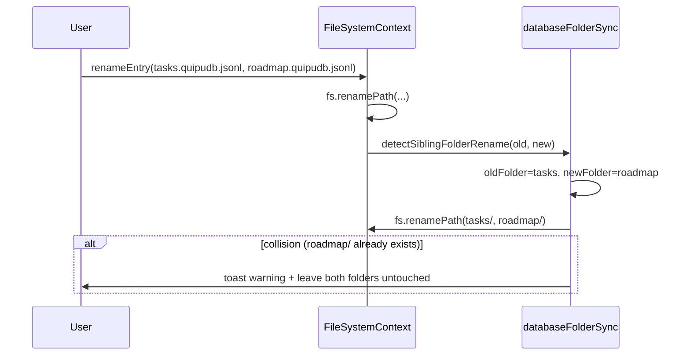
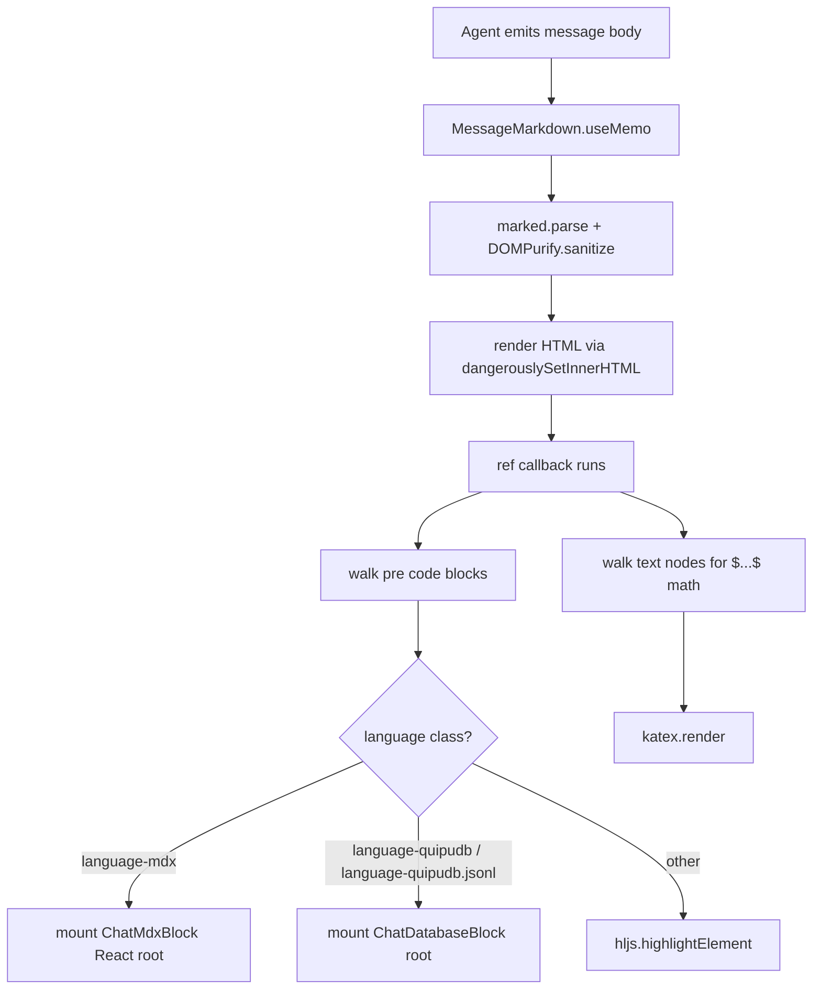

# Database polish, link columns, and chat MDX/quipudb rendering

## Overview

Bundle of database UX fixes and three new capabilities, all centered on making `.quipudb.jsonl` databases first-class across the editor and the agent chat:

1. **Layout & embed fixes** — align the standalone viewer with the document title, size the table to its columns (own internal scroll, not document scroll), and fix the inline embed's weird positioning while adding a "change source database" action that works in both contexts.
2. **Link column type** — a new column type whose cells hold file references. Two modes: `global` (path relative to workspace root) and `relative` (path inside a sibling folder named after the database, auto-created and kept in sync as the database file is moved/renamed/deleted). Cells offer pick-existing and create-new actions; create-new instantiates a file using a per-column default extension.
3. **Markdown-editor "Link Database" fix** — the slash command currently does nothing in some flows; investigate and repair so `[[file.quipudb.jsonl]]`-style picking actually inserts an embed.
4. **Chat custom rendering with auto-installed skills** — the agent chat will recognize ```mdx and ```quipudb.jsonl fenced blocks and render them as a curated MDX surface and a read-only DatabaseViewer respectively. Two skills (`mdx` and `quipudb`) are auto-installed alongside `frame` so the agent knows when and how to emit those blocks. Both renderings mirror Quipu's color palette and typography.

## Problem Frame

The v1 database (see origin: `docs/brainstorms/2026-04-08-database-view-requirements.md` and plan `docs/plans/2026-04-08-001-feat-database-view-plan.md`) shipped a working table/board viewer for `.quipudb.jsonl`, an inline TipTap node, and slash commands to embed/create databases. Real use surfaced gaps:

- **Visual misalignment** — standalone DB title has `px-10` padding but the table body is flush against the activity bar (see screenshot 1). Inline embeds use a JS `ResizeObserver` full-bleed hack that produces "weird" positioning at certain document widths (see screenshot 2). Tables are forced to fill the panel width even when they have one column, and overflow scrolls the whole document instead of the database.
- **No way to switch source** — once an inline embed is placed, the user cannot point it at a different `.quipudb.jsonl` file from either the standalone or inline interface. The slash-command "Link Database" sometimes does nothing depending on environment / event-handler state.
- **No file-link primitive** — databases cannot reference files. Notion's "files & media" / page-link columns are a primary way users connect tabular data to documents. Quipu has no equivalent; users cannot store a path to a `.md` file inside a row and click to open it. They especially cannot create new sibling files from a row, which is the natural workflow for "row = task with notes".
- **Chat does not know databases or rich content exist** — the agent emits markdown tables for any tabular response, which is illegible past a few columns and discards type information. There is no way to ask the agent "give me a board of these tasks" and have a real database render in the conversation. There is also no mechanism for rich UI in chat (cards, badges, callouts) — only markdown.

## Requirements Trace

- R1. Standalone database content is horizontally aligned with the database title and toolbar; not flush against the activity bar.
- R2. Database tables size to their columns (not full panel width). Horizontal overflow scrolls inside the database container, not the document.
- R3. Inline embedded databases are positioned predictably (no JS-driven full-bleed hack that flickers or misaligns). The user can change the source database from the embed.
- R4. The standalone viewer also offers "change source database" parity (rename/relink the file backing the current tab) — agent-native parity goal: anything UI does, the agent skill can describe.
- R5. The "Link Database" slash command in the markdown editor reliably opens a file picker in both Electron and browser runtimes, and inserts an `embeddedDatabase` node on selection.
- R6. New column type: `link`. Schema additions: `mode: 'global' | 'relative'`, optional `defaultExtension: string` (default `.md`).
- R7. Link cells display the linked file's display name (basename without extension) and open the file on click. Empty cells show a "+ Pick / Create" affordance.
- R8. `Pick` opens a file picker scoped appropriately: workspace-wide for `global`, sibling-folder-only for `relative`. `Create` instantiates a new file using `defaultExtension` and writes the path into the cell.
- R9. For relative-mode columns, a sibling folder with the same name as the database file (without `.quipudb.jsonl` suffix) is automatically managed: created on first use, renamed when the database is renamed, moved when the database is moved, deleted when the database is deleted (with confirmation).
- R10. The agent chat renders ```mdx fenced blocks as a sandboxed React surface using a curated Quipu component palette (`Card`, `Badge`, `Callout`, `Stat`, `Row`, `Col`, plus markdown text).
- R11. The agent chat renders ```quipudb.jsonl fenced blocks as a read-only DatabaseViewer styled to match Quipu's palette.
- R12. Two skills (`mdx` and `quipudb`) are installed and kept up-to-date next to `frame` whenever a workspace is opened, mirroring `installFrameSkills`.
- R13. The agent system prompt preamble (in `AgentContext.tsx`) tells the agent: prefer `quipudb.jsonl` for tabular data, prefer `mdx` for rich/structured presentation; the curated component vocabulary; the JSONL schema-line format.

## Scope Boundaries

- No SQL, no remote databases, no relations between `.quipudb.jsonl` files.
- No real-time collaboration in chat blocks (renders are read-only or local-only).
- The MDX surface is **not** general-purpose JSX evaluation — it's a curated, sandboxed component palette evaluated through `@mdx-js/mdx` with a fixed `components` map. No `<script>`, no arbitrary imports, no dynamic React component lookup.
- No undo/redo for sibling-folder lifecycle (rename/move/delete cascade is best-effort with toasts on failure).
- No backfill: existing databases without link columns are unchanged. Existing relative-mode sibling folders for hand-created data are not auto-detected; they are created on first link cell use.
- No board-view changes for link columns (board grouping by link is a future enhancement).
- The `frame` skill is unchanged in behavior; `installFrameSkills` is renamed in spirit (not signature) to install all three skills.

## Context & Research

### Relevant Code and Patterns

- `src/extensions/database-viewer/DatabaseViewer.tsx` — standalone + inline mode shell. Already has `mode: 'standalone' | 'inline'` prop; this plan adds `mode: 'chat'` for read-only chat rendering.
- `src/extensions/database-viewer/components/TableView.tsx` — TanStack Table with `width: table.getCenterTotalSize()`. Container uses `flex-1 overflow-auto` but lacks horizontal padding to align with the `px-10` title.
- `src/extensions/database-viewer/types.ts` — `ColumnType` union and discriminated `ColumnDef` types. Add `link` variant alongside the six existing.
- `src/extensions/database-viewer/components/ColumnManager.tsx` — `AddColumnDialog` and `ColumnHeaderMenu`. New type needs new dialog fields.
- `src/extensions/database-viewer/hooks/useColumnDefs.ts` — maps each column type to a TanStack `ColumnDef` with cell renderer. Add `LinkCell`.
- `src/extensions/database-viewer/hooks/useDatabase.ts` — central state. May need to expose database file path so `LinkCell` can resolve sibling folder and run create-new actions.
- `src/components/editor/extensions/EmbeddedDatabase.ts` — TipTap node. Currently uses a JS `ResizeObserver` full-bleed trick (lines 84-103); replace with CSS containment. Add a header dropdown to change `src`.
- `src/components/editor/extensions/SlashCommand.ts` lines 130-165 — `Link Database` and `Create Database` items dispatch `quipu:pick-database` / `quipu:create-database`. Diagnose path-resolution and dialog-fallback bug.
- `src/App.tsx` lines 730-794 — handlers for those events. The fallback `setInputDialog` path may bypass the callback in certain cases; investigate.
- `src/styles/prosemirror.css` lines 327-334 — current `embedded-database-wrapper` baseline (`-40px / +80px`). Will be redesigned to be CSS-only.
- `src/services/claudeInstaller.ts` — `installFrameSkills` writes `frame.md` skill, `frame.md` command, `load-frame.sh` script, and merges a PostToolUse hook into `settings.json`. Mirror exactly for `mdx` and `quipudb`.
- `src/context/FileSystemContext.tsx` `renameEntry` (line 296), `deleteEntry` (line 284), and the equivalent move flow — sibling-folder cascade hooks here.
- `src/extensions/agent-chat/MessageMarkdown.tsx` — current rendering: `marked.parse` + DOMPurify + `hljs.highlightElement` on `pre code`. We need to intercept `pre code.language-mdx` and `pre code.language-quipudb` (the `marked` `language-` class output) before highlight runs and replace those nodes with React roots.
- `src/context/AgentContext.tsx` `buildQuipuContextPrompt` (line 255) — the system-prompt preamble. Append guidance about MDX and quipudb fenced blocks.
- `src/services/fileSystem.ts` — `readFile`, `writeFile`, `createFile`, `createFolder`, `renamePath`, `deletePath`, `openFileDialog`. All needed for link columns and sibling folders.
- `src/types/tab.ts` — `ActiveFile.path` and `Tab` shape. `DatabaseViewer` receives `activeFile`, so it already has the database's full path for resolving sibling folder.

### Institutional Learnings

- **Extension-registry contract** (`docs/EXTENSIONS.md`): No App.tsx changes needed for new viewers. The chat is not an extension — chat rendering goes inside `MessageMarkdown` directly.
- **isInitializedRef pattern** for editable viewers (Excalidraw, useDatabase): always preserve when extending modes. The chat read-only mode does not need it; standalone mode keeps it.
- **Dual runtime**: `fs.openFileDialog` works in Electron via IPC, falls back via prompt in browser. The link-cell pick flow must use the same dual approach.
- **Toast UX**: All file-system failures (rename, sibling-folder create) must call `showToast(message, 'error')` per the project standard. Never `console.error` alone.
- **`frame` install hook**: `installFrameSkills` is invoked from both `selectFolder` (`FileSystemContext.tsx:244`) and the auto-open path (`FileSystemContext.tsx:330`). Both call sites need updating once we rename to `installAgentSkills` (or add a wrapper) so `mdx` and `quipudb` install too.

### External References

- `@mdx-js/mdx` v3 — compiles MDX text to a JavaScript module. With `evaluate({...mdx, useMDXComponents})` and a fixed `components` map, we get a sandbox-friendly MDX evaluation. No filesystem or remote imports because we feed source through `compile`/`evaluate` only.
- DOMPurify — already in use; will continue sanitizing the HTML chat path. MDX sandboxing is structural (curated `components` only), not regex-based, so DOMPurify is not the right control plane for MDX nodes — they are React subtrees, not raw HTML.
- `marked` token classification — `marked` annotates fenced code with `class="language-<info>"` on the inner `<code>`. We can detect `language-mdx` and `language-quipudb` (or `language-quipudb.jsonl`; `marked` keeps the literal info string before whitespace) and route to React mounts.

## Key Technical Decisions

- **Replace JS full-bleed hack with CSS containment for inline embeds.** The current `ResizeObserver` approach in `EmbeddedDatabase.ts:84-103` rewrites `style.width` and `style.marginLeft` on every panel resize, causing visible reflow. Switch to a CSS-only solution: a wrapper that uses `display: block; width: 100%;` inside the document and lets the inner DB scroll horizontally. Drop the negative-margin trick entirely. The DB will live inside the document column (816px page width) but introduce its own horizontal scroll for wider tables.

- **Database table sizes to its columns; the database container scrolls internally.** Remove `flex-1` width-fill on the table wrapper. The TanStack table already sets `style.width = table.getCenterTotalSize()`. Wrap it in `overflow-x-auto` so horizontal overflow stays inside the database. The standalone viewer's outer container keeps `flex-1` for **height** but sets `width: fit-content; max-width: 100%` for the table and `overflow-x: auto` on its scroll parent.

- **Single horizontal padding token used by all DB elements.** Introduce one CSS variable `--db-h-pad` (40px default) and apply it to the title row, toolbar, and the scroll container's left/right padding. Title and table contents will then share an alignment line in standalone mode.

- **Link column shape: one type, two modes.** `ColumnType` gains `'link'`. The discriminated `LinkColumnDef` carries `mode: 'global' | 'relative'` and optional `defaultExtension: string` (default `.md`). Cell value is `string | null` storing the path; for `global` it is workspace-relative; for `relative` it is sibling-folder-relative. We always store paths, never resolved file content.

- **Sibling folder is named after the database file's basename (without `.quipudb.jsonl`).** Created lazily on first relative-link write or first create-new-file action — never up-front, to avoid clutter when no relative links exist. Renamed/moved/deleted in lockstep via a hook in `FileSystemContext.renameEntry` / `deleteEntry`. The hook detects database files by extension and applies the sibling-folder rule.

- **Sibling-folder lifecycle is best-effort, not transactional.** If the rename succeeds but the sibling-folder rename fails, we toast a warning and leave the user to fix manually. We do not roll back the database rename. This matches the rest of Quipu's file ops.

- **Chat rendering is component-replacement, not markdown extension.** `MessageMarkdown` keeps marked + DOMPurify for the bulk of the message. After sanitization and DOM mount, a second pass walks `pre code.language-{mdx,quipudb,quipudb.jsonl}` nodes, removes them from the DOM, and mounts a React root in their place — same pattern as the existing `hljs.highlightElement` + KaTeX walks.

- **MDX in chat is curated, not arbitrary.** Use `@mdx-js/mdx` `evaluate` with a fixed `components` map: `Card`, `Callout`, `Badge`, `Stat`, `Row`, `Col`, plus `a/p/h1-h6/ul/ol/li/strong/em/code/pre/blockquote` mapping to Quipu-styled equivalents. No `import` statements allowed (MDX 3 supports import; we strip via `recmaPlugins` or pre-validate the source). On evaluation error, fall back to a `<pre>` showing the source plus the error message — never crash the chat.

- **Quipu-style palette mirrored across both renderings.** Both the chat database block and the chat MDX components consume the same theme tokens (`bg-bg-surface`, `text-text-primary`, `bg-accent-muted`, etc.). The chat database block uses `mode: 'chat'` on `DatabaseViewer` — read-only, max height ~360px, no toolbar, internal scroll, rounded card chrome.

- **Auto-installer becomes plural; skills are upserted on every workspace open.** Rename internal symbol `installFrameSkills` to `installAgentSkills` (keep the export name as a default export for compatibility) and add `mdx.md`, `quipudb.md` skills. Templates always overwrite (same as today's frame.md template) so updates ship via app upgrade. Hook merge logic stays the same — only `frame` writes a hook today; `mdx` and `quipudb` are documentation-only skills, no hooks.

- **System prompt update is additive, not restructuring.** Append a "## Rich rendering" section to `buildQuipuContextPrompt` after the existing math section, listing: `mdx` and `quipudb.jsonl` fenced-block conventions, the available MDX components, the JSONL schema-line shape (one `_schema` line, then row lines), and the rule "for tabular data prefer ```quipudb.jsonl; for rich UI prefer ```mdx."

## Open Questions

### Resolved During Planning

- **MDX runtime**: `@mdx-js/mdx` `evaluate` with a curated `components` map. Evaluated client-side at chat render time. Errors render a fallback `<pre>` with the source.
- **Sibling folder naming**: `<database-basename-without-extension>/` next to the `.quipudb.jsonl` file. No suffix, no prefix. If a folder of that name already exists when first needed, we adopt it (no prompt) — the user's intent is "this folder belongs to this database" either way.
- **Default file extension for create-new**: `.md` per column, configurable via `defaultExtension` in the `ColumnDef`. The `AddColumnDialog` defaults the field to `.md`.
- **Chat code-block detection**: `marked` annotates fenced blocks with `class="language-<info>"`. Detect `language-mdx`, `language-quipudb`, `language-quipudb.jsonl`. Other languages keep going through hljs unchanged.
- **What "Link Database" does today**: best hypothesis — the slash command dispatches `quipu:pick-database` and `App.tsx` calls `fs.openFileDialog`. In Electron the dialog opens but `filePath` may come back unrelativized; in browser the fallback prompt appears but its `onSubmit` callback re-invokes `callback` only on non-empty input — empty/canceled submissions silently no-op. The Unit will reproduce, then fix. Repair likely combines: (a) better fallback when openFileDialog rejects vs returns null, (b) a clearer toast when the user cancels, (c) verification that the inserted node renders in the markdown editor.

### Deferred to Implementation

- **Exact `--db-h-pad` value**: `40px` matches today's `px-10`, but may need to drop to `24px` for inline mode to feel right inside the document column. Tune visually.
- **Sibling folder collision strategy on rename**: if a user renames a database such that the new sibling-folder name collides with an existing folder, we currently plan to abort and toast — but a "merge into existing" option might be friendlier. Decide once we touch the rename code.
- **MDX components final API**: starting set is `Card`, `Callout`, `Badge`, `Stat`, `Row`, `Col`. We may add `Kbd`, `Link`, `Tag` after seeing what the agent naturally tries to emit.
- **Chat database block height**: 360px is a starting point; revisit if many rows feel cramped or 1-row tables feel too tall.
- **Whether to also intercept ```mdx in the standalone TipTap editor**: out of scope for this plan; chat-only for now.
- **Whether create-new for relative mode should also allow choosing a TipTap-style template**: probably yes long-term, but v1 is a single empty file with `defaultExtension`.

## High-Level Technical Design

> *This illustrates the intended approach and is directional guidance for review, not implementation specification. The implementing agent should treat it as context, not code to reproduce.*

### Layout token alignment (Phase 1)

```
┌──────────────────────────────────────────────────┐  ← editor panel
│  ←─── --db-h-pad ───→                            │
│  ┌────────────┐                                  │
│  │ Untitled   │  ← title (h1, px = --db-h-pad)   │
│  │ 0 rows     │                                  │
│  └────────────┘                                  │
│  ┌──────────────────────────────────────────┐    │
│  │ Filter | Sort        Table | Board       │    │  ← toolbar (px = --db-h-pad)
│  └──────────────────────────────────────────┘    │
│  ┌──────────────────────────────────────────┐    │
│  │ Teste   |  Status  |  ...  →             │    │  ← table (px = --db-h-pad on
│  │ ────────┼──────────┼────                 │    │    its scroll wrapper, table
│  │   row1  |   ...    |   ...               │    │    inside is fit-content)
│  └──────────────────────────────────────────┘    │
└──────────────────────────────────────────────────┘
```

### Inline embed layout (Phase 1)

Replace JS full-bleed with CSS containment. The embed lives inside the document column; horizontal overflow scrolls inside the embed.

```
┌── document column (max 816px) ──┐
│ paragraph...                     │
│ ┌─ embed wrapper ─────────────┐  │
│ │ [📊 untitled            ▼ ] │  │  ← header w/ change-source dropdown
│ │ ┌─ db scroll container ──┐  │  │
│ │ │ Teste │ Status │ ... → │  │  │  ← horizontal scroll lives here
│ │ └────────────────────────┘  │  │
│ └─────────────────────────────┘  │
│ paragraph...                     │
└──────────────────────────────────┘
```

### Sibling folder model (Phase 2)

```
workspace/
├── tasks.quipudb.jsonl         ← schema has one column { id: "notes", type: "link", mode: "relative", defaultExtension: ".md" }
└── tasks/                      ← sibling folder, auto-created on first relative-link write
    ├── ship-v1-notes.md        ← created via "+ Create" from a row, path stored as "ship-v1-notes.md" in cell
    └── docs-todo.md
```

When the user renames `tasks.quipudb.jsonl` to `roadmap.quipudb.jsonl`:



### Chat code-block dispatcher (Phase 3)



### Curated MDX surface

```
ChatMdxBlock(source: string)
  ├─ @mdx-js/mdx evaluate(source, { useMDXComponents: () => COMPONENTS })
  ├─ COMPONENTS = { Card, Callout, Badge, Stat, Row, Col, a, p, h1..h6, ... }
  ├─ on success: render <MDXContent />
  └─ on error:   render <pre className="text-error">{source}\n\n{error.message}</pre>
```

Each curated component (`Card`, `Callout`, `Badge`, etc.) is a small React component that uses Quipu theme tokens (`bg-bg-surface`, `text-text-primary`, `bg-accent-muted`) and Phosphor icons. They are the same components we'd offer in the standalone editor's MDX support later — kept in `src/extensions/agent-chat/mdx-components/`.

## Implementation Units

### Phase 1: Layout & embed UX fixes

- [ ] **Unit 1: Standalone DB padding alignment + column-sized table with internal scroll**

  **Goal:** Standalone DB title, toolbar, and table contents share the same left edge. The table sizes to its columns; horizontal overflow scrolls inside the database, never bubbling to the document.

  **Requirements:** R1, R2

  **Dependencies:** None

  **Files:**
  - Modify: `src/extensions/database-viewer/DatabaseViewer.tsx`
  - Modify: `src/extensions/database-viewer/components/TableView.tsx`
  - Modify: `src/styles/theme.css` (add `--db-h-pad` token)
  - Test: `src/__tests__/database-viewer-layout.test.tsx`

  **Approach:**
  - Introduce a single horizontal-padding token `--db-h-pad: 40px` in `theme.css`.
  - Replace ad-hoc `px-10` usages on title row and toolbar with `style={{ paddingInline: 'var(--db-h-pad)' }}` (or a Tailwind arbitrary value).
  - Apply the same padding to TableView's outer scroll container left/right so the first column header sits under the title's left edge.
  - Drop `flex-1` width on the table; keep `flex-1` on its **height-bearing** parent (`flex flex-col min-h-0 overflow-hidden`).
  - Wrap the `<table>` in a `<div className="overflow-x-auto">` inside the scroll wrapper. The TanStack `style.width = table.getCenterTotalSize()` already drives column-sized width.
  - Empty/no-columns state shifts horizontally too — keep its centering logic intact but inside the padded container.

  **Patterns to follow:**
  - Existing theme token usage in `src/styles/theme.css` and `src/components/editor/Editor.tsx` (page-bg / page-text tokens).

  **Test scenarios:**
  - Happy path: render standalone viewer with 1 column, 0 rows -> title, toolbar, and column header all start at the same `paddingInline` from the panel's left edge (assert via `getBoundingClientRect().left` equality).
  - Happy path: render with 8 columns whose total size > panel width -> only the database container shows a horizontal scrollbar; the surrounding panel does not.
  - Happy path: render with 1 narrow column -> table width is `getCenterTotalSize()`, less than panel width; right side is empty space, not stretched cells.
  - Edge case: zero columns empty state stays centered relative to the panel content area, not flush left.
  - Edge case: change `--db-h-pad` at runtime (CSS var override in a wrapper) -> all three rows reflow together.

  **Verification:**
  - Visual check against screenshot 1: title and `Teste` column header share a left edge.
  - No horizontal scrollbar on the editor panel when DB has many columns.

- [ ] **Unit 2: Inline embed CSS-only positioning + change-source dropdown**

  **Goal:** Replace the `ResizeObserver`-driven full-bleed hack with deterministic CSS. The embed lives inside the document column with its own internal horizontal scroll. The header gains a dropdown to pick a different `.quipudb.jsonl`.

  **Requirements:** R3, R4

  **Dependencies:** Unit 1 (so the inline DatabaseViewer respects the same padding token)

  **Files:**
  - Modify: `src/components/editor/extensions/EmbeddedDatabase.ts`
  - Modify: `src/styles/prosemirror.css` (replace `.embedded-database-wrapper` rule)
  - Modify: `src/extensions/database-viewer/DatabaseViewer.tsx` (add change-source action prop)
  - Test: `src/__tests__/embedded-database-layout.test.ts`

  **Approach:**
  - Remove the `updateFullBleed` function, the `requestAnimationFrame` block, and the `ResizeObserver` wiring (lines ~84-103 of `EmbeddedDatabase.ts`).
  - In `prosemirror.css`, redefine `.embedded-database-wrapper` to `display: block; width: 100%; margin: 1rem 0; border-radius: 6px; border: 1px solid var(--color-border); overflow: hidden;`. The inner DB drives its own horizontal scroll.
  - The header bar (DB icon + name + path) stays. Add a Phosphor `CaretDown` button at the right that opens a Radix DropdownMenu with two items: "Change source database…" and "Open standalone".
  - "Change source database…" dispatches a new `quipu:pick-database` event whose callback calls `view.dispatch(tr.setNodeAttribute(pos, 'src', newPath))` to update the node's `src` attribute in place. Refresh the React root by remounting with the new `src`.
  - "Open standalone" reuses today's click handler (`quipu:open-embedded-database`).
  - Standalone parity: `DatabaseViewer.tsx` gets a header dropdown too — "Rename file…" and "Open in folder" (rename triggers `renameEntry` flow). The change-source action makes less sense in standalone (the file IS the source); we offer rename instead.

  **Patterns to follow:**
  - Radix DropdownMenu pattern from `ColumnHeaderMenu` in `ColumnManager.tsx`.
  - TipTap `setNodeAttribute` (or `view.dispatch(state.tr.setNodeMarkup(pos, undefined, { ...attrs, src }))`) for in-place attribute updates.

  **Test scenarios:**
  - Happy path: insert `![[tasks.quipudb.jsonl]]`, embed renders; resize the editor panel -> embed width adapts via CSS only, no JS reflow.
  - Happy path: open header dropdown -> "Change source database…" -> pick `roadmap.quipudb.jsonl` -> embed re-renders showing roadmap data; serialized markdown is `![[roadmap.quipudb.jsonl]]`.
  - Happy path: embed with a 12-column DB -> horizontal scrollbar appears inside the embed; document does not gain a horizontal scrollbar.
  - Edge case: pick the same file -> no-op, no remount flicker.
  - Edge case: pick a non-existent file -> "Could not load database" fallback, header still shows the source name and a retry hint.
  - Integration: open the same DB in a tab and embed it; edit a cell in the tab -> embed reflects the change after save (file watcher).

  **Verification:**
  - No `ResizeObserver` left in `EmbeddedDatabase.ts`.
  - Pick-source flow updates the node's `src` attribute and the markdown serializer emits the new path.

- [ ] **Unit 3: Diagnose & fix "Link Database" slash command**

  **Goal:** Reproduce why "Link Database" sometimes does nothing, then fix. Ensure the inserted `embeddedDatabase` node renders in the markdown editor in both Electron and browser modes.

  **Requirements:** R5

  **Dependencies:** None (parallel-able with Unit 2)

  **Files:**
  - Modify: `src/components/editor/extensions/SlashCommand.ts` (Link Database / Create Database items)
  - Modify: `src/App.tsx` (handlers for `quipu:pick-database`, `quipu:create-database`)
  - Test: `src/__tests__/slash-command-link-database.test.tsx`

  **Approach:**
  - Reproduction step: open a `.md` file, type `/link database`, observe in both runtimes whether the picker opens, whether the callback fires, whether the insert succeeds.
  - Likely defects to handle: (a) `fs.openFileDialog` resolves with `null` on cancel and we treat that as "no input" silently — fix by surfacing a toast; (b) the dialog filter `extensions: ['quipudb.jsonl']` may not match because the OS file picker treats compound extensions inconsistently — broaden filter to `['jsonl']` plus a name filter by basename; (c) callback receives an absolute path on cancel-then-pick paths, breaking relative storage — normalize at callback boundary.
  - Add a single test that mocks `fs.openFileDialog` and walks the full slash → event → callback → editor.insertContent path.

  **Execution note:** Start with a failing reproduction test for the broken flow before changing code.

  **Test scenarios:**
  - Happy path: pick existing `.quipudb.jsonl` -> embeddedDatabase node inserted with workspace-relative `src`.
  - Edge case: cancel the picker -> no node inserted, no error toast (cancel is benign).
  - Edge case: picker errors (e.g., handler unregistered) -> fallback path-prompt opens; submitting a path inserts the node; canceling shows nothing.
  - Edge case: picker returns an absolute path outside workspace -> we keep it absolute and toast a warning suggesting moving the file inside the workspace.
  - Integration: after insert, the node renders via `EmbeddedDatabase`'s `addNodeView` and shows the database content.

  **Verification:**
  - Reproduction test passes.
  - Manual Electron + browser smoke confirms the picker opens and the embed renders.

### Phase 2: Link column type + sibling folder management

- [ ] **Unit 4: Link column type — schema, parser, AddColumnDialog**

  **Goal:** Extend the database schema with a `link` column type carrying `mode: 'global' | 'relative'` and `defaultExtension`. Surface it in the Add Column dialog.

  **Requirements:** R6

  **Dependencies:** None (parallel-able with Phase 1)

  **Files:**
  - Modify: `src/extensions/database-viewer/types.ts` (add `LinkColumnDef`)
  - Modify: `src/extensions/database-viewer/components/ColumnManager.tsx` (AddColumnDialog gets mode + default extension fields)
  - Modify: `src/extensions/database-viewer/utils/jsonl.ts` (parse/serialize support — link cells are strings, no special handling)
  - Modify: `src/extensions/database-viewer/hooks/useDatabase.ts` (changeColumnType conversions for link)
  - Test: `src/__tests__/link-column-schema.test.ts`

  **Approach:**
  - `LinkColumnDef` extends `BaseColumnDef`: `{ type: 'link'; mode: 'global' | 'relative'; defaultExtension?: string }`.
  - Add `'link'` to `ColumnType` union and the `ColumnDef` discriminated union.
  - `AddColumnDialog`: when type=`link` is selected, show a radio for mode (Global / Relative) and a text input for default extension (placeholder `.md`). Strip leading dot if user types one.
  - `changeColumnType`: from any other type to `link` -> existing string values are kept as the link value; from `link` to text -> keep as string; from `link` to other -> set to null.

  **Patterns to follow:**
  - Existing select/multi-select `options` field handling in `AddColumnDialog`.
  - Discriminated-union widening pattern in `types.ts`.

  **Test scenarios:**
  - Happy path: add a link column with mode=global, defaultExtension=`.md` -> serialized schema contains `{ type: 'link', mode: 'global', defaultExtension: '.md' }`.
  - Happy path: add a link column with mode=relative -> sibling-folder logic enabled (verified in Unit 6).
  - Happy path: change column type from text to link, mode=global -> existing text values retained as link strings.
  - Edge case: `defaultExtension` typed as `md` (no dot) -> normalized to `.md` on save.
  - Edge case: `defaultExtension` empty -> falls back to `.md` at create-time, schema stores the empty string explicitly so users can change to "no extension" if needed.

  **Verification:**
  - Schema round-trip with link columns is identical after parse/serialize.

- [ ] **Unit 5: LinkCell renderer — display, pick existing, open**

  **Goal:** Render link cells as openable file references with type-correct affordances.

  **Requirements:** R7, R8 (pick-existing half)

  **Dependencies:** Unit 4

  **Files:**
  - Create: `src/extensions/database-viewer/components/cells/LinkCell.tsx`
  - Modify: `src/extensions/database-viewer/hooks/useColumnDefs.ts` (route `link` columns to LinkCell)
  - Modify: `src/extensions/database-viewer/DatabaseViewer.tsx` (pass `databaseFilePath` so the cell can resolve sibling folder)
  - Test: `src/__tests__/link-cell.test.tsx`

  **Approach:**
  - `LinkCell` props: `value: string | null`, `column: LinkColumnDef`, `databaseFilePath: string`, `workspacePath: string`, `updateCell(value)`, `openFile(path)`.
  - Display: if `value` is set, show file basename (without extension) prefixed with a Phosphor `LinkSimple` icon. Click opens the file via `openFile`. If `value` is null, show a muted "+ Pick / Create" affordance with a chevron that opens a small menu.
  - Pick flow:
    - For `mode='global'`: `fs.openFileDialog({ filters: [...] })` scoped at workspace root.
    - For `mode='relative'`: scope the picker to the sibling folder. If `fs.openFileDialog` cannot scope, fall back to listing the sibling folder via `fs.readDirectory` and presenting a cmdk list.
  - On selection, normalize the path:
    - `global` -> workspace-relative
    - `relative` -> sibling-folder-relative (just basename)
  - Open flow uses `useTab().openFile` (passed in via context, not direct hook in cell to keep the cell pure-ish).

  **Patterns to follow:**
  - Existing cmdk-based dropdown pattern from `SelectCell.tsx`.
  - `App.tsx`'s `handlePickDatabase` for picker fallback handling.

  **Test scenarios:**
  - Happy path: link cell with value `notes/spec.md` (global) -> displays "spec" with link icon; clicking calls `openFile('notes/spec.md')`.
  - Happy path: link cell with value `ship-v1.md` (relative, db at workspace root) -> displays "ship-v1"; clicking calls `openFile('<db-basename>/ship-v1.md')`.
  - Happy path: empty cell, click "+ Pick" with mode=global -> picker opens at workspace root; pick `notes/spec.md` -> cell value becomes `notes/spec.md`.
  - Happy path: empty cell, click "+ Pick" with mode=relative, sibling folder has 3 files -> cmdk list shows those 3; pick one -> cell value is its basename.
  - Edge case: relative-mode pick with sibling folder absent -> picker shows "No files yet — create one"; "+ Pick" remains usable but list is empty.
  - Edge case: file at the path is missing on click-to-open -> toast "File not found: <path>".
  - Edge case: link cell with extremely long path -> truncated with ellipsis, full path on title attribute hover.

  **Verification:**
  - All four flows (display set / display empty / pick global / pick relative) work with no console errors.

- [ ] **Unit 6: Sibling folder lifecycle — create, rename, move, delete**

  **Goal:** Auto-manage `<db-basename>/` next to each `.quipudb.jsonl` so relative-mode link cells have a stable home. Renaming/moving/deleting the database cascades.

  **Requirements:** R9

  **Dependencies:** Unit 4 (sibling folder is created on first relative-link write)

  **Files:**
  - Create: `src/services/databaseFolderSync.ts`
  - Modify: `src/context/FileSystemContext.tsx` (`renameEntry`, `deleteEntry`, drag-and-drop move handler)
  - Modify: `src/extensions/database-viewer/components/cells/LinkCell.tsx` (call `ensureSiblingFolder` before relative-mode write)
  - Test: `src/__tests__/databaseFolderSync.test.ts`

  **Approach:**
  - `databaseFolderSync.ts` exports:
    - `siblingFolderPath(databasePath: string): string` — strip `.quipudb.jsonl` from the file path.
    - `ensureSiblingFolder(databasePath: string): Promise<void>` — `fs.createFolder` if missing; idempotent.
    - `renameSiblingFolder(oldDbPath, newDbPath): Promise<{ ok: boolean; error?: string }>` — rename only if old folder exists and new folder does not. Return result for caller-driven toasts.
    - `deleteSiblingFolder(databasePath): Promise<{ ok: boolean; error?: string }>` — best-effort, skips if folder is missing.
  - Wire into `FileSystemContext`:
    - `renameEntry(old, new)` — if both ends look like `.quipudb.jsonl` files, after the file rename succeeds, call `renameSiblingFolder` and toast on conflict/failure.
    - `deleteEntry(path)` — if `.quipudb.jsonl` and a sibling folder exists with non-zero contents, prompt user "Also delete sibling folder `<name>/` (N files)?" before continuing. Empty sibling folders are deleted silently.
    - Move (drag-drop in `FileExplorer`) currently calls `renameEntry` with new path -> the same hook covers it.
  - Detection rule: a "database file" is anything ending with `.quipudb.jsonl`. Renames that change the extension fall back to the default rename (no sibling-folder logic).

  **Patterns to follow:**
  - Existing `renameEntry` callback shape in `FileSystemContext.tsx:296`.
  - Toast usage from `showToast(message, type)`.

  **Test scenarios:**
  - Happy path: write a relative link in a fresh DB -> sibling folder is created on first write; subsequent writes don't recreate it.
  - Happy path: rename `tasks.quipudb.jsonl` to `roadmap.quipudb.jsonl` -> sibling folder also renames `tasks/` -> `roadmap/`.
  - Happy path: drag `tasks.quipudb.jsonl` into a subfolder -> both file and sibling folder land in the subfolder.
  - Happy path: delete `tasks.quipudb.jsonl` with empty sibling folder -> sibling folder deleted silently.
  - Edge case: delete `tasks.quipudb.jsonl` with 5 files in sibling folder -> confirmation dialog appears; "Cancel" leaves both intact; "Delete both" removes both.
  - Edge case: rename to a name whose sibling folder already exists -> rename succeeds for the file, but folder rename aborts with a toast warning.
  - Edge case: rename a non-database `.md` file -> no sibling folder logic runs.
  - Edge case: drag the database file into its own sibling folder -> reject the move with a toast (would create a cycle); leave both intact.
  - Edge case: sibling folder exists but is a file (someone created `tasks` as a regular file) -> abort sibling-folder rename and toast; never overwrite.
  - Integration: open the DB after rename -> link cells with relative paths still resolve, because the path-resolution logic uses the *current* database path's sibling folder, not a stored absolute path.

  **Verification:**
  - All cascade behaviors work; collisions toast instead of silently corrupting.

- [ ] **Unit 7: Create-new-file action in link cells**

  **Goal:** Add a "+ Create" affordance in empty link cells. Clicking creates a new file using the column's `defaultExtension`, places it in the right location (workspace-root for global, sibling folder for relative), and stores its path in the cell.

  **Requirements:** R8 (create-new half)

  **Dependencies:** Unit 5, Unit 6

  **Files:**
  - Modify: `src/extensions/database-viewer/components/cells/LinkCell.tsx`
  - Test: `src/__tests__/link-cell-create.test.tsx`

  **Approach:**
  - When the cell is empty, the dropdown shows "Pick existing…" and "Create new". Selecting Create new opens a small inline input for the new file name.
  - Append `defaultExtension` if the user-typed name doesn't already end in it.
  - For `global`: file is created at workspace root by default (or in a subfolder if user types `subfolder/name`).
  - For `relative`: `ensureSiblingFolder(databasePath)` first, then create the file inside it. Cell stores just the basename.
  - On success, immediately open the newly created file in a new tab so the user can start editing.

  **Patterns to follow:**
  - `App.tsx:773` Create-Database flow — input dialog + `fs.createFile` + `fs.writeFile` with empty content.

  **Test scenarios:**
  - Happy path: empty global link cell, type `spec` -> file `spec.md` created at workspace root, cell stores `spec.md`, file opens in new tab.
  - Happy path: empty relative link cell with db at root, type `notes` -> sibling folder created if needed, `notes.md` written inside it, cell stores `notes.md`.
  - Happy path: type `subfolder/note.md` (global) -> intermediate folder created if needed.
  - Edge case: file already exists at the chosen path -> reject with toast "File already exists; use Pick existing instead".
  - Edge case: `defaultExtension` is empty string -> file is created without extension; cell stores the bare name.

  **Verification:**
  - Created files exist on disk; cells link to them; file watcher picks them up if the user later edits them outside the DB.

### Phase 3: Chat custom rendering with auto-installed skills

- [ ] **Unit 8: Chat MessageMarkdown dispatcher for `mdx` and `quipudb` blocks**

  **Goal:** After marked + DOMPurify, walk the rendered DOM and replace `pre code.language-{mdx,quipudb,quipudb.jsonl}` blocks with React mounts.

  **Requirements:** R10, R11

  **Dependencies:** None (parallel-able with Phase 2)

  **Files:**
  - Modify: `src/extensions/agent-chat/MessageMarkdown.tsx`
  - Create: `src/extensions/agent-chat/CustomCodeBlocks.ts` (the walk + React mount helper)
  - Test: `src/__tests__/agent-chat-custom-blocks.test.tsx`

  **Approach:**
  - **Ordering invariant**: the custom-block walk MUST run before `hljs.highlightElement`, because `hljs` mutates the `<code>` className (adding `hljs language-xxx`) and inserts highlighted spans, which would break source extraction. Keep the order: (1) walk and replace mdx/quipudb blocks, (2) `hljs.highlightElement` on the rest, (3) `renderMathInNode`.
  - In `MessageMarkdown`'s `ref` callback, query `pre code` and inspect the className for `language-mdx`, `language-quipudb`, `language-quipudb.jsonl`.
  - For each match: extract the source from `code.textContent` (before any hljs run), find the parent `<pre>`, replace it with a fresh `<div className="agent-custom-block">`, and call `createRoot(div).render(<ChatMdxBlock source={source} />)` (or `<ChatDatabaseBlock source={source} />`).
  - Track mounted roots in a `WeakMap<Element, Root>` keyed by the **container** element so streaming updates re-using the same DOM container don't double-mount. On `body` change (new content), unmount stale roots before remounting.
  - The parent `ref` cleanup (when the component unmounts) iterates the WeakMap and unmounts all roots tied to that subtree.
  - Skip the `hljs.highlightElement` and KaTeX walks for replaced nodes (they're gone from the DOM by then; tree-walker naturally skips them).

  **Patterns to follow:**
  - Existing `hljs.highlightElement` and `renderMathInNode` walk patterns in `MessageMarkdown.tsx:30-44`.
  - `createRoot` + cleanup pattern from `EmbeddedDatabase.ts:106-117`.

  **Test scenarios:**
  - Happy path: agent message with one ```mdx block -> MDX block rendered; rest of message rendered normally.
  - Happy path: agent message with one ```quipudb.jsonl block -> chat database block rendered.
  - Happy path: agent message with both -> both render in the right positions.
  - Edge case: ```mdx with malformed source -> fallback `<pre>` with error message renders; no chat crash.
  - Edge case: streaming update — the component re-mounts on body change; ensure no React warnings about double-rendered roots.
  - Edge case: hljs language other than mdx/quipudb -> goes through hljs unchanged.

  **Verification:**
  - The dispatcher recognizes the three language strings and routes correctly.
  - No React root leaks across message updates.

- [ ] **Unit 9: ChatDatabaseBlock — read-only DatabaseViewer for chat**

  **Goal:** Render a `quipudb.jsonl` source as a read-only DatabaseViewer styled to match Quipu's chat surface.

  **Requirements:** R11

  **Dependencies:** Unit 8

  **Files:**
  - Create: `src/extensions/agent-chat/ChatDatabaseBlock.tsx`
  - Modify: `src/extensions/database-viewer/DatabaseViewer.tsx` (add `mode='chat'`: read-only, no toolbar, max-h, internal scroll, rounded card chrome)

  **Approach:**
  - `ChatDatabaseBlock` parses `source` via `parseQuipuDb`. On parse error, falls back to a `<pre>` with the source plus the error.
  - On success, renders `<DatabaseViewer content={source} onContentChange={undefined} mode="chat" />`.
  - In `DatabaseViewer`, the `chat` mode:
    - No header, no view-switcher tabs (only the active table view renders).
    - No filter bar / Add Column / Add Row affordances.
    - No cell editing (cell renderers receive a `readOnly` prop).
    - Container: `max-h-[360px] overflow-hidden rounded-md border border-border bg-bg-surface`.
    - The TableView's outer scroll wrapper retains internal vertical + horizontal scroll.
  - Cell renderers gain a `readOnly` flag and render display-only variants (no click-to-edit). Reuse the same display branches that already exist before the edit-mode toggle.

  **Patterns to follow:**
  - Existing `mode === 'inline'` branch in `DatabaseViewer.tsx`.

  **Test scenarios:**
  - Happy path: 3-column, 5-row source -> renders inside a 360px-tall card; scrollbars appear if needed.
  - Happy path: clicking a text cell does nothing (read-only) — no input appears.
  - Happy path: long table renders with vertical scrollbar inside the card; chat does not scroll.
  - Edge case: malformed JSONL source -> `<pre>` fallback with inline error.
  - Edge case: zero-row database -> shows the standard empty state, but without the Add-Row button.

  **Verification:**
  - Visual styling matches existing Quipu cards (theme tokens, rounded-md, border).
  - No editing path is reachable.

- [ ] **Unit 10: ChatMdxBlock — sandboxed MDX renderer with curated Quipu palette**

  **Goal:** Compile and render MDX source with a fixed `components` map; on error, fall back to a styled error pre.

  **Requirements:** R10

  **Dependencies:** Unit 8

  **Files:**
  - Create: `src/extensions/agent-chat/ChatMdxBlock.tsx`
  - Create: `src/extensions/agent-chat/mdx-components/index.ts`
  - Create: `src/extensions/agent-chat/mdx-components/Card.tsx`
  - Create: `src/extensions/agent-chat/mdx-components/Callout.tsx`
  - Create: `src/extensions/agent-chat/mdx-components/Badge.tsx`
  - Create: `src/extensions/agent-chat/mdx-components/Stat.tsx`
  - Create: `src/extensions/agent-chat/mdx-components/Row.tsx` (`Col` lives in same file)
  - Modify: `package.json` (add `@mdx-js/mdx`)
  - Test: `src/__tests__/chat-mdx-block.test.tsx`

  **Approach:**
  - `ChatMdxBlock(source)` calls `evaluate(source, { ...runtime, useMDXComponents: () => COMPONENTS })` from `@mdx-js/mdx`. `runtime` is React's `Fragment`, `jsx`, `jsxs` from `react/jsx-runtime`. Wrap the rendered MDX in a React error boundary so runtime render errors (a component throws on weird props) fall back to the same error-pre instead of crashing the whole chat.
  - `COMPONENTS` map: `{ Card, Callout, Badge, Stat, Row, Col, a, p, h1, h2, h3, h4, h5, h6, ul, ol, li, strong, em, code, pre, blockquote }`. Each maps to a small Tailwind-styled component using Quipu theme tokens.
  - **Sandbox guarantees** (defense in depth):
    - Pre-validate source: reject any line starting with `import ` or `export `, and any occurrence of `dangerouslySetInnerHTML`, `__html`, or `<script`. Fallback to error-pre on any match.
    - Each curated component accepts only an explicit, typed prop list — no `{...rest}` spreading. `Card` accepts `title?, children, variant?`; `Callout` accepts `type?, title?, children`; `Badge` accepts `color?, children`; etc. Unknown props are dropped silently.
    - Anchor (`a`) component: validate `href` against an allowlist (`http:`, `https:`, `quipu://`); strip `javascript:` and `data:`. Force `rel="noopener noreferrer"` and `target="_blank"`.
    - The mapped HTML elements (`p`, `h1`, etc.) render via React without `dangerouslySetInnerHTML`, so HTML injection through MDX text is impossible by construction.
  - Each component accepts standard children + a small set of theme variants (`<Callout type="info|warn|error">`, `<Badge color="accent|muted|success">`, etc.).
  - Components live in their own files for testability and to allow future reuse (e.g., a standalone TipTap MDX node).

  **Patterns to follow:**
  - Existing badge/card styling in `src/components/ui/badge.tsx` and Quipu card patterns in PluginManager.
  - Error rendering: `text-error` + `bg-error/10` + `<pre>` style.

  **Test scenarios:**
  - Happy path: `<Card title="Hello">Body</Card>` -> renders a Quipu-styled card.
  - Happy path: nested MDX with markdown inside `<Card>` (paragraph, strong, code) -> renders correctly with theme styles.
  - Happy path: `<Row><Col>A</Col><Col>B</Col></Row>` -> two-column flex layout.
  - Edge case: `<Unknown />` (component not in map) -> renders as plain text or `<unknown>`-style element (MDX behavior); no crash.
  - Edge case: source with `import 'fs'` -> caught by pre-validation, fallback `<pre>` shown.
  - Edge case: malformed JSX (`<Card><Card>`) -> evaluate throws, fallback `<pre>` with error message.
  - Security: source containing `<script>alert(1)</script>` -> rendered as text, no script execution.
  - Security: `<a href="javascript:alert(1)">click</a>` -> href stripped or rewritten; no js: scheme reaches the DOM.
  - Security: `<Card dangerouslySetInnerHTML={{__html:''}}` -> pre-validation rejects, fallback shows error.
  - Security: any `import`/`export` line in source -> rejected by pre-validation.

  **Verification:**
  - All Quipu components render with theme tokens (no hardcoded colors).
  - Sandbox: imports/exports fail gracefully.

- [ ] **Unit 11: Auto-install `mdx` + `quipudb` skills, update agent system prompt**

  **Goal:** When a workspace opens, also install `mdx.md` and `quipudb.md` skills next to `frame.md`. Update the agent's system-prompt preamble so it knows the conventions.

  **Requirements:** R12, R13

  **Dependencies:** Phase 3 rendering exists (so the prompt can describe what works)

  **Files:**
  - Modify: `src/services/claudeInstaller.ts` (add MDX_SKILL and QUIPUDB_SKILL templates; extend the existing `installFrameSkills` function body to write all three skill files. Keep the function name to avoid touching call sites.)
  - Modify: `src/context/FileSystemContext.tsx` — no changes needed; both call sites (lines 244 and 330) keep working.
  - Modify: `src/context/AgentContext.tsx` `buildQuipuContextPrompt` (append "## Rich rendering" section)
  - Test: `src/__tests__/claudeInstaller-skills.test.ts`

  **Approach:**
  - Add two skill templates (Markdown text in `claudeInstaller.ts`):
    - `MDX_SKILL` — explains the chat MDX surface, the curated component palette with examples, when to use it ("rich, structured presentation; cards/badges/callouts; comparison layouts").
    - `QUIPUDB_SKILL` — explains the JSONL schema-line-then-rows shape with one full example, the supported column types (including the new `link` type), when to use it ("any tabular data with >3 columns or where types matter").
  - Extend the install loop with `{ path: skillsDir + '/mdx.md', content: MDX_SKILL }` and `{ path: skillsDir + '/quipudb.md', content: QUIPUDB_SKILL }`. No new hooks needed (these skills are documentation-only).
  - Append to `buildQuipuContextPrompt` after the math section:
    ```
    ## Rich rendering
    
    For rich UI in chat, use a fenced ```mdx block with the curated components: Card, Callout, Badge, Stat, Row, Col.
    For tabular data, use a fenced ```quipudb.jsonl block with one schema line and one row per JSON line.
    Prefer ```quipudb.jsonl over markdown tables for any data with >3 columns or typed values.
    See the `mdx` and `quipudb` skills for examples.
    ```
  - Tests: assert that opening a workspace creates all three skill files; assert that the prompt preamble contains the new section.

  **Execution note:** Skill file contents are templates; keep them upserted on every install so updates ship via app upgrade — same policy as `frame.md`.

  **Test scenarios:**
  - Happy path: open a fresh workspace -> `.claude/skills/{frame,mdx,quipudb}.md` all exist with current content.
  - Happy path: open a workspace where `mdx.md` already has stale content -> file is overwritten with the new template (matches frame.md semantics).
  - Happy path: agent system prompt contains the new "## Rich rendering" section after the existing "## Math rendering" section.
  - Edge case: `.claude/settings.json` is invalid JSON -> install aborts the hook merge (existing behavior) but still writes skill files.
  - Edge case: workspace was opened in a previous version -> opening again upserts the new skills; no duplicates.

  **Verification:**
  - `frame.md`, `mdx.md`, `quipudb.md` all present after open.
  - System-prompt preamble includes Rich rendering guidance.

## System-Wide Impact

- **Interaction graph:** `EmbeddedDatabase`'s React root mounts `DatabaseViewer` as today; the new "change source" action mutates the TipTap node attribute via `view.dispatch`. `LinkCell` calls `useTab().openFile` (provider-injected) and `fs.createFile`/`fs.writeFile` directly. `databaseFolderSync` hooks into `FileSystemContext.renameEntry`/`deleteEntry`. Chat code-block dispatch lives entirely inside `MessageMarkdown` and creates short-lived React roots. `installAgentSkills` runs from the same two call sites that `installFrameSkills` runs today.
- **Error propagation:** All file ops surface via `showToast` per existing standard. Sibling-folder cascade failures toast warnings without rolling back the database file. MDX evaluation errors render an inline error pre, never crashing the chat. Database parse errors in chat fall back to a source pre.
- **State lifecycle risks:**
  - Sibling-folder rename + database rename are not atomic. If the file rename succeeds but the folder rename fails, the user has a database whose relative-link sibling is misnamed. Mitigation: clear toast naming both sides; the user can rename manually.
  - Chat React roots created in `MessageMarkdown.ref` callback can leak across streaming updates if not tracked in a WeakMap. Unit 8 mandates the WeakMap.
  - Skill files are overwritten on every workspace open. If a user customized them by hand, their changes are lost. This matches today's frame.md behavior; document in the skill files themselves ("auto-managed; edit upstream templates").
- **API surface parity:**
  - No Go server changes (all features use existing `readFile`, `writeFile`, `renamePath`, `deletePath`, `createFolder`, `openFileDialog` adapters).
  - No Electron IPC additions.
  - `ColumnType` extension is additive; existing JSONL files remain valid.
  - System-prompt preamble is appended to, not restructured — agents in prior sessions are unaffected until they restart.
- **Integration coverage:**
  - The chain rename-database -> sibling-folder-renames -> link cells still resolve must be tested end-to-end (unit-level + a focused integration test).
  - The chain agent-emits-quipudb-block -> chat parses -> renders -> matches palette must be tested visually.
  - The chain slash-command -> picker -> insert -> render must be re-tested in both runtimes (Unit 3).
- **Unchanged invariants:**
  - The `.quipudb.jsonl` schema-version field stays at `1` even with the new column type — link is an additive variant, not a breaking change.
  - `frame` skill semantics are unchanged.
  - The standalone editor (TipTap) does **not** gain MDX support in this plan; only chat does.
  - All existing column types (text, number, select, multi-select, date, checkbox) continue to behave identically.

## Risks & Dependencies

| Risk | Mitigation |
|------|------------|
| Sibling-folder rename collision corrupts user data | Detect collisions before rename; abort folder rename and toast a clear warning. Never silently merge. |
| `@mdx-js/mdx` bundle size increases chat startup cost | Lazy-load `ChatMdxBlock` and the `@mdx-js/mdx` import behind `React.lazy` so MDX eval only loads when a `mdx` block actually appears. |
| Chat React-root leaks on streaming updates | WeakMap-track mounted roots and unmount in the ref cleanup path; covered in Unit 8 tests. |
| MDX sandbox bypass via clever input | Pre-validate source for `import`/`export` lines; rely on `@mdx-js/mdx` `evaluate` semantics (no script tags survive); fallback `<pre>` on any eval error. No document.cookie or window globals are exposed via the components map. |
| Inline embed CSS regression vs current ResizeObserver behavior | Visual smoke at multiple panel widths (Unit 2 tests). Keep the negative-margin baseline as a CSS fallback only if the document column proves too narrow for typical embeds — but prefer dropping it entirely. |
| Skill template overwrite surprises power users who edit them by hand | Add a comment header to each skill template: `<!-- Auto-managed by Quipu. Edits will be overwritten on workspace open. -->`. |
| "Link Database" diagnosis turns out to be environment-specific (not reproducible in tests) | Unit 3 starts with a reproduction step; if no failing test can be written, document findings inline and fix only what is reproducible. |

## Sources & References

- **Origin document:** [docs/brainstorms/2026-04-08-database-view-requirements.md](docs/brainstorms/2026-04-08-database-view-requirements.md)
- Original database plan: [docs/plans/2026-04-08-001-feat-database-view-plan.md](docs/plans/2026-04-08-001-feat-database-view-plan.md)
- Standalone DB viewer: `src/extensions/database-viewer/DatabaseViewer.tsx`
- Inline embed: `src/components/editor/extensions/EmbeddedDatabase.ts`
- Slash commands: `src/components/editor/extensions/SlashCommand.ts`
- Chat rendering: `src/extensions/agent-chat/MessageMarkdown.tsx`
- Skill installer: `src/services/claudeInstaller.ts`
- Agent system prompt: `src/context/AgentContext.tsx` (`buildQuipuContextPrompt`)
- File system rename hook: `src/context/FileSystemContext.tsx`
- FRAME skill (template + auto-install reference): `.claude/skills/frame.md`
- `@mdx-js/mdx` evaluate API: https://mdxjs.com/packages/mdx/#evaluatefile-options
- Marked language class output (`language-<info>` on inner `<code>`): https://marked.js.org/using_pro
