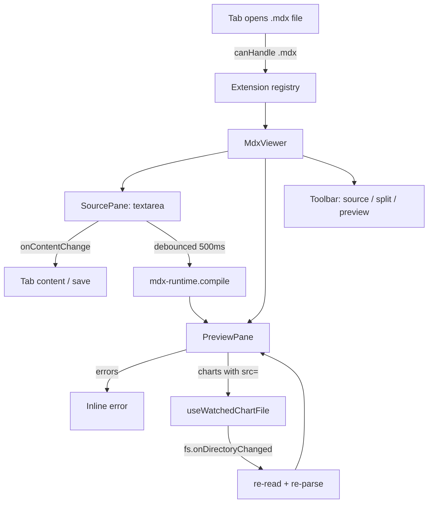

# MDX as a first-class file type in Quipu

## Overview

Promote MDX from a chat-only rendering surface to a workspace file type. Opening a `.mdx` file in Quipu mounts a split source/preview viewer using the curated component palette already shipped for chat — `Card`, `Callout`, `Badge`, `Stat`, `Row`, `Col`, `LineChart`, `BarChart`, `AreaChart`, `PieChart`. Charts that reference workspace files via `src=` auto-refresh when the underlying `.csv` / `.tsv` / `.json` / `.jsonl` / `.quipudb.jsonl` changes on disk. Inline `![[notes.mdx]]` embedding inside `.md` files mirrors the existing `EmbeddedDatabase` pattern so notes can stitch live MDX blocks into prose.

The same sandbox posture from the chat block carries over verbatim: no `import`/`export`, no `dangerouslySetInnerHTML`, no `<script>`, and only the curated component map is reachable.

## Problem Frame

Users today can compose rich MDX in chat — cards, charts driven by workspace files, stats — but everything else in the workspace is plain markdown or plain code. The natural workflow is:

1. Agent emits a rich response in chat
2. User wants to keep it next to their other notes
3. They paste it into a `.md` file and the visual structure collapses to a fenced code block

We already have all the pieces (MDX compiler + curated palette + chart data loaders); they just need to be reachable outside `MessageMarkdown`. Once `.mdx` is a real file type, the agent can produce durable rich documents the user can edit, share via git, and reference from chat. Charts that auto-refresh from workspace files turn MDX into a live dashboard surface, not just a static template.

## Requirements Trace

- R1. Opening any `.mdx` file in the workspace mounts the MDX viewer (not the TipTap markdown editor and not a plain code editor).
- R2. The viewer offers three modes: source-only, split (default), preview-only. The user can toggle between them from a toolbar control.
- R3. The source pane is a text editor (Monaco or plain `<textarea>`) that round-trips file content with the dirty-state + save flow the rest of Quipu uses.
- R4. The preview pane compiles the current source through `@mdx-js/mdx` `evaluate` using the same component map the chat block uses. Compile errors render as the existing error `<pre>` fallback; no crashes.
- R5. The MDX runtime — `MDX_COMPONENTS`, `validateMdxSource`, `ChatMdxErrorBoundary`, the chart components — moves to a shared module so both the chat block and the new viewer import from the same place. No duplicated palette.
- R6. Chart `src=` references in the viewer subscribe to file changes. Editing `data/foo.csv` (or any supported format) on disk re-renders the chart automatically. The chat block keeps its one-shot load — only the standalone viewer watches.
- R7. `.mdx` files can be embedded inline in `.md` files via `![[notes.mdx]]`, mirroring the existing `EmbeddedDatabase` flow. Slash commands offer "Link MDX" and "Create MDX" entries.
- R8. The MDX viewer is registered alongside `database-viewer` in core — not distributed as a plugin — because the rich-rendering story is fundamental to Quipu.
- R9. The `mdx` skill template and agent system prompt mention that `.mdx` is now a workspace file the agent can read, write, and reference from chat.

## Scope Boundaries

- **No WYSIWYG editing.** Source-pane edits remain text-based. A TipTap-style round-trip would require parsing MDX → editor JSON → MDX, which is fundamentally harder than CommonMark and out of scope for v1.
- **No plugin-extensible component palette.** The component map is hard-coded in core; no `register()` API for third-party MDX components.
- **No remote / network MDX imports.** Same sandbox posture as chat — `import`/`export` are rejected at compile time.
- **No MDX 3 features beyond what `evaluate()` supports.** No `expressionType: 'flow'` extensions, no custom remark plugins beyond what the chat block already uses.
- **No multi-file MDX projects.** Each `.mdx` file stands alone; cross-file references through `import` are explicitly out.
- **No tooltip / hover preview** when hovering over chart-source-file references in MDX. Future enhancement.

## Context & Research

### Relevant Code and Patterns

- `src/extensions/database-viewer/` — closest sibling. Mirrors what we want for `.mdx`: in-core viewer extension, descriptor-based registration, split internal layout, dirty-state via `onContentChange`.
- `src/extensions/registry.ts` — `registerExtension({ id, canHandle, priority, component, onSave? })`. New MDX descriptor lands here.
- `src/extensions/index.ts` — side-effect registration entry point. Add the MDX viewer alongside `database-viewer` and `diff-viewer`.
- `src/utils/fileTypes.ts` — file type predicates (`isQuipuDbFile`). Add `isMdxFile`.
- `src/extensions/agent-chat/mdx-components/` — current home of `MDX_COMPONENTS`, `validateMdxSource`, `ChatMdxErrorBoundary`, and the chart components. Move this to a neutral location and re-export from chat.
- `src/extensions/agent-chat/ChatMdxBlock.tsx` — chat-side consumer. Updates to import from the new shared location; otherwise unchanged.
- `src/extensions/agent-chat/mdx-components/charts/dataLoader.ts` — current `useChartFile` is one-shot. Extend with a watching variant that subscribes via `fs.onDirectoryChanged`.
- `src/services/fileSystem.ts` — `onDirectoryChanged` already exposes a callback registration with a cleanup function. We use the existing dual-runtime adapter; no new IPC needed.
- `src/services/fileWatcher.ts` — workspace-wide change detection already in place.
- `src/components/editor/extensions/EmbeddedDatabase.ts` — TipTap node + change-source dropdown + slash command flow. Direct template for `EmbeddedMdx`.
- `src/components/editor/extensions/SlashCommand.ts` — `Link Database` / `Create Database` entries. Add `Link MDX` / `Create MDX` mirrors.
- `src/App.tsx` — `quipu:pick-database` / `quipu:create-database` event handlers. Add `quipu:pick-mdx` / `quipu:create-mdx` mirrors with the same browser-mode fallback the database flow now has (Unit 3 of the previous plan).
- `src/extensions/code-viewer/` (if present) and Monaco patterns — reference for the source pane text editor. If Monaco is already loaded for other extensions, reuse it; otherwise consider a lighter `<textarea>` for the source pane.
- `src/services/claudeInstaller.ts` — `installFrameSkills` upserts `mdx.md`. Update the template to mention the file type.
- `src/context/AgentContext.tsx` — `buildQuipuContextPrompt`. Add one sentence about `.mdx` being a real file type the agent can write to.

### Institutional Learnings

- **Extension registry pattern** (`docs/EXTENSIONS.md`): descriptor with `canHandle`, `priority`, `component`, `onSave`. No `App.tsx` changes required.
- **Non-TipTap save path**: `onContentChange(serializedString)` stores content on the tab; `onSave` reads it back. The MDX viewer is text-based so the same flow applies as `database-viewer`.
- **`isInitializedRef` guard**: prevent false dirty state on the initial parse — see `useDatabase`.
- **Sibling-folder service pattern** (from the database plan): `databaseFolderSync` keeps a folder in lockstep with a file. Not needed for MDX in v1, but the same approach would apply if we ever auto-create an MDX sibling folder for assets.
- **Skill-template overwrite policy**: templates always upsert on workspace open. Existing `mdx.md` will get the file-type update for free.
- **CSS-only inline embed sizing**: lesson learned from the prior `EmbeddedDatabase` fix — no JS `ResizeObserver` hacks. `EmbeddedMdx` should follow the same CSS-only layout from day one.

### External References

External research skipped. Local patterns are strong on every axis this plan touches:

- Viewer extension shape: 3+ existing examples (database-viewer, excalidraw-viewer, notebook-viewer).
- MDX compilation: already shipped in `ChatMdxBlock`.
- File watching: already used by `fileWatcher.ts` and the file explorer.
- TipTap inline node: already shipped in `EmbeddedDatabase`.

If implementation surfaces a gap (e.g., debounce timing for live preview), we'll lean on the database viewer's choices (500ms data debounce, 2s view-config debounce) as the starting point.

## Key Technical Decisions

- **Split source/preview is the v1 default.** Read-only render is too thin for a real editing workflow; WYSIWYG is fundamentally harder for MDX (JSX, not CommonMark). Split mirrors how every mainstream MDX tool (MDX Editor, Storybook docs, Notion-style editors) works, and lets the user develop content with live feedback. The mode toggle accommodates users who want pure source or pure preview.
- **Single shared MDX runtime module under `src/extensions/mdx-runtime/`.** Both the chat block and the file viewer import the components, validator, and error boundary from one place. The current `src/extensions/agent-chat/mdx-components/` becomes a thin re-export to keep the chat side import surface stable. Naming: "runtime" (not "components") because the module also exposes `validateMdxSource` and the chart data loader.
- **Live file watching via a `useWatchedChartFile` hook, not a flag on the existing hook.** The chat block is intentionally one-shot — chats are ephemeral and watching every chart in scrollback would leak. The standalone viewer composes the watching variant. The watching hook re-reads on `fs.onDirectoryChanged` events that match the resolved file path, with a 250ms debounce so a rapid burst of writes doesn't thrash the parser.
- **Text-based source editor, not Monaco.** Quipu's code-viewer extension uses Monaco, but loading Monaco solely for MDX source editing adds ~5MB to the bundle for a feature most users will spend more time previewing than editing. v1 ships a `<textarea>` with TipTap-style auto-grow + Tab insertion. Syntax highlighting can be added later if needed (treat the textarea as a stopgap, not a final form).
- **Compile debounce: 500ms.** Matches the data-debounce used in `useDatabase`. Quick enough to feel live, slow enough to avoid re-compiling on every keystroke.
- **Error display lives inside the preview pane, not the source pane.** Compile errors show as the existing styled error `<pre>` (same as the chat block). Source pane stays as the canonical input surface.
- **Inline embedding (`EmbeddedMdx`) included in v1.** Cost is modest (the database template is reusable) and the workflow value is high — mixing MDX blocks into `.md` notes is the natural extension of the chat experience.
- **Same security posture as chat.** `validateMdxSource` runs before `evaluate()` in the file viewer too. Anchor href scrubbing, prop allowlisting on curated components, and the React error boundary all carry over without modification.
- **No save-format conversion.** `.mdx` files are plain text. Save writes whatever the source pane contains. No TipTap JSON, no markdown round-trip, no frontmatter parsing in v1.

## Open Questions

### Resolved During Planning

- **Editing UX**: split source/preview pane, mode-toggle for source-only and preview-only. WYSIWYG is v2.
- **Component palette location**: extract to `src/extensions/mdx-runtime/`; chat re-exports from there.
- **File watcher**: separate `useWatchedChartFile` hook to keep chat one-shot behavior pure.
- **Inline embedding**: yes, in v1. Mirror `EmbeddedDatabase`.
- **Source editor**: plain `<textarea>` for v1. Monaco can come later if real authoring volume justifies the bundle weight.
- **Extension placement**: in-core (not a plugin) — alongside `database-viewer`.

### Deferred to Implementation

- **Exact debounce values** for live preview compile (start with 500ms) and for live data refresh (start with 250ms). Tune in `ce:work` after first visual smoke.
- **Split-pane initial ratio.** 50/50 vs 40/60 in favor of preview. Pick visually; persist per-tab if the existing PaneView state can carry it, otherwise punt.
- **Textarea ergonomics.** Auto-grow vs fixed height with scroll; Tab key inserts spaces vs default focus behavior; multiline indent. Decide as the source pane lands.
- **Whether to highlight unknown MDX components in the preview** as a soft warning (e.g., "Unknown component `Foo`, rendered as plain text"). Nice-to-have, not blocking.
- **Whether `.mdx` files should also expose `quipu:pick-mdx` and `quipu:create-mdx` flows in the FileExplorer context menu**, matching the database "New Database" entry. Likely yes, but not load-bearing.

## High-Level Technical Design

> *This illustrates the intended approach and is directional guidance for review, not implementation specification. The implementing agent should treat it as context, not code to reproduce.*

### Module reorganization (Unit 1)

```
src/extensions/
  mdx-runtime/                ← NEW shared home
    components/               ← Card, Callout, Badge, Stat, Row, Col
    charts/                   ← LineChart, BarChart, AreaChart, PieChart, dataLoader
    index.ts                  ← MDX_COMPONENTS, validateMdxSource, ChatMdxErrorBoundary
    useWatchedChartFile.ts    ← NEW watching variant (Unit 4)
  agent-chat/
    mdx-components/           ← thin re-export from mdx-runtime to keep chat imports stable
    ChatMdxBlock.tsx          ← unchanged behaviour; imports from mdx-runtime
  mdx-viewer/                 ← NEW Unit 2-3
    index.ts                  ← extension descriptor
    MdxViewer.tsx             ← split source/preview shell
    SourcePane.tsx            ← textarea + dirty-state plumbing
    PreviewPane.tsx           ← compile + render via mdx-runtime
    Toolbar.tsx               ← view-mode toggle
```

### Standalone viewer flow (Units 2-3)



### Live data refresh (Unit 4)

```
useWatchedChartFile(src):
  1. Resolve src → fullPath (workspace-relative)
  2. Initial load via fs.readFile + parseChartFile (same as useChartFile)
  3. Subscribe via fs.onDirectoryChanged(event):
       if event.path matches fullPath OR event.path is the parent dir of fullPath:
         debounce(250ms) → re-read → re-parse → setState(rows)
  4. Cleanup: unsubscribe on hook unmount
```

The watching variant lives next to `useChartFile` so the data-loader API surface is one module; the standalone viewer's `PreviewPane` overrides which hook the chart components consume via a React context provider.

### Inline embedding (Unit 5)

```
.md file content:
  Some prose here.

  ![[notes.mdx]]

  More prose.

EmbeddedMdx (TipTap node):
  - parseHTML / renderHTML / markdown serializer mirror EmbeddedDatabase
  - addNodeView mounts a React root with MdxViewer in 'preview' mode
  - Header bar: filename + "..." menu (Change source, Open standalone)
  - Layout: CSS-only — width: 100%, internal scroll, no ResizeObserver hack
```

## Implementation Units

### Phase 1: Shared MDX runtime

- [ ] **Unit 1: Extract shared MDX runtime module**

**Goal:** Move `MDX_COMPONENTS`, `validateMdxSource`, `ChatMdxErrorBoundary`, and all chart components out of `src/extensions/agent-chat/mdx-components/` into a neutral `src/extensions/mdx-runtime/`. Keep chat-side imports working.

**Requirements:** R5

**Dependencies:** None.

**Files:**
- Create: `src/extensions/mdx-runtime/index.ts` — re-exports `MDX_COMPONENTS`, `validateMdxSource`, `ChatMdxErrorBoundary`
- Create: `src/extensions/mdx-runtime/components/Card.tsx` (moved)
- Create: `src/extensions/mdx-runtime/components/Callout.tsx` (moved)
- Create: `src/extensions/mdx-runtime/components/Badge.tsx` (moved)
- Create: `src/extensions/mdx-runtime/components/Stat.tsx` (moved)
- Create: `src/extensions/mdx-runtime/components/Row.tsx` (moved)
- Create: `src/extensions/mdx-runtime/charts/Charts.tsx` (moved)
- Create: `src/extensions/mdx-runtime/charts/dataLoader.ts` (moved)
- Modify: `src/extensions/agent-chat/mdx-components/index.tsx` — becomes a thin re-export from `mdx-runtime`
- Modify: `src/extensions/agent-chat/ChatMdxBlock.tsx` — update import path to `mdx-runtime`
- Test: `src/__tests__/mdx-runtime-exports.test.ts`

**Approach:**
- Pure code-move + re-export. No behavior change.
- The thin re-export in `agent-chat/mdx-components/index.tsx` exists for one or two releases as a deprecation shim, then can be deleted in a follow-up commit. Document the transition with a one-line comment.
- Keep file names identical post-move so blame history follows naturally with `git mv`.
- The new `mdx-runtime/charts/dataLoader.ts` exports both the existing `useChartFile` and a stub `useWatchedChartFile` (real implementation in Unit 4). The stub re-uses `useChartFile` so charts in the chat block still work between this unit and Unit 4.

**Patterns to follow:**
- Existing module organization in `src/extensions/database-viewer/` (sibling-by-concern).

**Test scenarios:**
- Happy path: importing `MDX_COMPONENTS` from `@/extensions/mdx-runtime` returns the full map (`Card`, `Callout`, `Badge`, `Stat`, `Row`, `Col`, `LineChart`, `BarChart`, `AreaChart`, `PieChart`).
- Happy path: importing from the old `@/extensions/agent-chat/mdx-components` returns the same map (back-compat shim).
- Happy path: `validateMdxSource` import from the new location rejects `import` statements identically.
- Integration: `ChatMdxBlock` continues to render a known-good MDX source through the new import path — no regression.

**Verification:**
- Existing chat-block tests still pass.
- No remaining imports from the old `agent-chat/mdx-components/charts/` or `agent-chat/mdx-components/components/` paths in production code (search the repo).

### Phase 2: Standalone .mdx viewer

- [ ] **Unit 2: Extension registration and file type detection**

**Goal:** Register a new `mdx-viewer` extension with the extension registry so opening a `.mdx` file from the file explorer (or via Quick Open) mounts the viewer instead of falling through to the markdown TipTap editor.

**Requirements:** R1, R8

**Dependencies:** Unit 1.

**Files:**
- Create: `src/extensions/mdx-viewer/index.ts` — extension descriptor (`id`, `canHandle`, `priority`, `component`, `onSave`)
- Create: `src/extensions/mdx-viewer/MdxViewer.tsx` — placeholder component (full UI lands in Unit 3)
- Modify: `src/utils/fileTypes.ts` — add `isMdxFile`
- Modify: `src/extensions/index.ts` — side-effect import the new extension
- Test: `src/__tests__/mdx-viewer-registration.test.ts`

**Approach:**
- Mirror `src/extensions/database-viewer/index.ts` exactly. `canHandle(tab) => isMdxFile(tab.name)`. Priority 10 (above any generic plain-text fallback, below specialised previews if any).
- The Unit 2 `MdxViewer.tsx` is a stub: renders the filename and source content as plain text so the registry wiring can be tested before Unit 3 builds the real UI.
- `isMdxFile`: ends in `.mdx` (case-insensitive).

**Patterns to follow:**
- `src/extensions/database-viewer/index.ts`
- `src/utils/fileTypes.ts:isQuipuDbFile`

**Test scenarios:**
- Happy path: `isMdxFile('notes.mdx')` returns true.
- Happy path: `isMdxFile('Notes.MDX')` returns true (case insensitive).
- Edge case: `isMdxFile('notes.md')` returns false.
- Edge case: `isMdxFile('mdx.txt')` returns false.
- Integration: resolving a tab with `name: 'notes.mdx'` through `resolveViewer` returns the `mdx-viewer` descriptor (not the TipTap editor).

**Verification:**
- Opening a `.mdx` file mounts the placeholder `MdxViewer` and shows its raw content; opening a `.md` file still mounts the TipTap editor unchanged.

- [ ] **Unit 3: MdxViewer with source / preview / split modes**

**Goal:** Replace the placeholder with the real viewer: a split-pane layout with a textarea source pane on the left, a compiled MDX preview pane on the right, and a toolbar control to toggle between source-only, split (default), and preview-only.

**Requirements:** R2, R3, R4, R5

**Dependencies:** Unit 2.

**Files:**
- Modify: `src/extensions/mdx-viewer/MdxViewer.tsx` — full split layout
- Create: `src/extensions/mdx-viewer/SourcePane.tsx` — textarea + dirty plumbing
- Create: `src/extensions/mdx-viewer/PreviewPane.tsx` — compile via `mdx-runtime` + render
- Create: `src/extensions/mdx-viewer/Toolbar.tsx` — view-mode toggle
- Modify: `src/extensions/mdx-runtime/index.ts` — export a `compileMdxSource(source)` helper (thin wrapper around `evaluate` + the components map) so the viewer doesn't duplicate the chat block's compile logic
- Test: `src/__tests__/mdx-viewer-compile.test.ts`

**Approach:**
- Outer container: `flex flex-col h-full`. Toolbar `shrink-0` at top, panes fill the rest.
- View modes (`source` | `split` | `preview`) drive which panes render. Toolbar buttons use Phosphor icons (`CodeIcon`, `LayoutIcon`, `EyeIcon`).
- `SourcePane`: a `<textarea>` with `flex: 1`, monospace font, Tab key inserts two spaces, fires `onChange(text)` on every keystroke. The parent `MdxViewer` calls `onContentChange(text)` (debounced 500ms for save / dirty state) and feeds the same text into `PreviewPane`.
- `PreviewPane`: receives the live source, runs it through `compileMdxSource` debounced at 500ms. Compile errors render the same styled error `<pre>` shape the chat block uses. Successful compiles render the resulting MDX component inside `ChatMdxErrorBoundary` (renamed to `MdxErrorBoundary` during the Unit 1 move) so a render-time throw doesn't crash the viewer.
- Toolbar lives at the top of the viewer; left side shows the filename + dirty dot, right side shows the mode toggle.
- Padding alignment: reuse the `--db-h-pad` token introduced for the database viewer so MDX, database, and editor surfaces share one horizontal padding rhythm.
- `compileMdxSource(source)`: returns `{ ok: true; Content: React.ComponentType } | { ok: false; error: string }`. Validates first via `validateMdxSource`, then calls `evaluate`. Wraps both for consistent error shape.

**Patterns to follow:**
- `src/extensions/database-viewer/DatabaseViewer.tsx` — outer container, toolbar pattern, mode prop.
- `src/extensions/agent-chat/ChatMdxBlock.tsx` — current compile + error fallback logic; lift into `compileMdxSource`.
- `src/extensions/excalidraw-viewer/ExcalidrawViewer.tsx` — `isInitializedRef` to avoid false dirty flag on initial mount.

**Test scenarios:**
- Happy path: known-good MDX source (`<Card title="Hi">Body</Card>`) renders in the preview pane.
- Happy path: editing the source updates the preview after the debounce window.
- Happy path: malformed MDX (`<Card><Card>`) shows the error `<pre>` in the preview pane; the source pane is unchanged.
- Happy path: `validateMdxSource` rejection (`import x from 'y'`) shows the validation error message.
- Happy path: toolbar toggle to `source` hides the preview pane; toggle to `preview` hides the source pane; toggle back to `split` shows both.
- Edge case: empty file — preview renders nothing, source is the empty textarea, no error.
- Edge case: very long source (10K lines) — textarea scrolls; preview still compiles (slowness acceptable, no crash).
- Integration: source-pane edit → `onContentChange` → tab dirty dot appears → Ctrl+S saves → file on disk contains the edited source.

**Verification:**
- Open a `.mdx` file with mixed components (Card + Callout + LineChart with inline data). All three render. Edit source, see live preview, save, reload — content persists.

### Phase 3: Live data via file watcher

- [ ] **Unit 4: Watching variant of chart file loader**

**Goal:** Add a `useWatchedChartFile` hook that loads a workspace file (CSV / TSV / JSON / JSONL / quipudb.jsonl) and re-reads when the file changes on disk. Wire it into chart components when they render inside the standalone MDX viewer (chat block keeps the one-shot loader).

**Requirements:** R6

**Dependencies:** Unit 1, Unit 3.

**Files:**
- Modify: `src/extensions/mdx-runtime/charts/dataLoader.ts` — implement `useWatchedChartFile`
- Create: `src/extensions/mdx-runtime/charts/ChartFileContext.ts` — a tiny React context that lets the viewer override which loader the chart components consume
- Modify: `src/extensions/mdx-runtime/charts/Charts.tsx` — read the loader from context, fall back to `useChartFile`
- Modify: `src/extensions/mdx-viewer/PreviewPane.tsx` — wrap the rendered MDX in a `ChartFileContext.Provider` that supplies `useWatchedChartFile`
- Test: `src/__tests__/useWatchedChartFile.test.ts`

**Approach:**
- `useWatchedChartFile(src)` reuses the loading + parsing logic from `useChartFile` (factor into a shared `loadChartFile(fullPath)` helper if useful).
- Subscribe via `fs.onDirectoryChanged((event) => { ... })`. On every event, check whether the event path equals the resolved chart file path or one of its parent directories — re-read and re-parse when it matches.
- Debounce the re-parse at 250ms with a trailing edge so a flurry of writes (common in editor save scenarios) collapses to one re-render.
- Cleanup: the hook's effect returns an unsubscribe that runs on unmount or `src` change.
- `ChartFileContext`: defaults to `useChartFile` (current chat behavior). The standalone viewer's `PreviewPane` provides `useWatchedChartFile` via the context so charts in that subtree get the watching variant for free.
- Chat block continues using the default context value — no changes there.

**Patterns to follow:**
- `src/services/fileSystem.ts:onDirectoryChanged` callback registration shape.
- The existing `useChartFile` hook for the load / parse / state-shape pattern.

**Test scenarios:**
- Happy path: initial mount loads the file content and returns rows.
- Happy path: simulated `onDirectoryChanged` event for the watched file triggers a re-load after the debounce window; the hook returns the new rows.
- Happy path: unrelated change event (different file) does NOT trigger a re-load.
- Edge case: file deleted between events — re-load fails; hook surfaces the error without crashing.
- Edge case: rapid burst of 5 events within 250ms collapses to a single re-load.
- Edge case: hook unmounts before the debounce timer fires — no `setState` on an unmounted component.
- Integration: chart rendered inside `PreviewPane` re-renders after the underlying CSV is rewritten by an external editor.

**Verification:**
- Open a `.mdx` file referencing `<LineChart src="data/foo.csv" ... />`. Edit `data/foo.csv` in another tab, save it, and watch the chart re-render without manually reloading the MDX viewer.

### Phase 4: Inline embedding in .md

- [ ] **Unit 5: EmbeddedMdx TipTap node + slash commands**

**Goal:** Let `.md` files embed live `.mdx` snippets via `![[notes.mdx]]`, mirroring the existing `EmbeddedDatabase` pattern. Slash commands provide "Link MDX" and "Create MDX" entries.

**Requirements:** R7

**Dependencies:** Unit 3.

**Files:**
- Create: `src/components/editor/extensions/EmbeddedMdx.ts` — TipTap node
- Modify: `src/styles/prosemirror.css` — add `.embedded-mdx-wrapper` styles mirroring `.embedded-database-wrapper`
- Modify: `src/components/editor/extensions/SlashCommand.ts` — add `Link MDX` / `Create MDX` items
- Modify: `src/App.tsx` — add `quipu:pick-mdx` and `quipu:create-mdx` event handlers (mirror the now-fixed pick-database handler)
- Modify: `src/components/editor/Editor.tsx` — register `EmbeddedMdx` alongside `EmbeddedDatabase`
- Test: `src/__tests__/embedded-mdx.test.ts`

**Approach:**
- `EmbeddedMdx` is a `Node.create` atom node with a `src` attribute; markdown serialization is `![[src]]\n\n` (same shape as embedded database, distinguished by the file extension in the path).
- `addNodeView` mounts a React root that renders `MdxViewer` in `preview` mode (no source pane). Header bar matches embedded database: filename + "..." dropdown with "Change source" and "Open standalone".
- CSS-only sizing — width 100%, internal scroll, rounded card chrome. No `ResizeObserver`. Reuse the lesson from the database embed fix.
- "Change source" reuses `quipu:pick-mdx` which mirrors the corrected `quipu:pick-database` flow: detect runtime up front, fall back to a path prompt when no native dialog is available, broaden the file filter to include `.mdx`.
- "Create MDX" uses `setInputDialog` for the name, creates an empty `.mdx` file, embeds it.
- Inline mode of the MDX viewer disables the source pane (effectively view-mode=`preview`-only); user opens the standalone tab via the menu when they want to edit.

**Patterns to follow:**
- `src/components/editor/extensions/EmbeddedDatabase.ts` — full template; copy + adapt.
- `src/App.tsx:handlePickDatabase` after the Unit 3 fix — runtime detection, filter shape, browser-mode fallback.
- `src/styles/prosemirror.css` `.embedded-database-wrapper` — CSS-only sizing reference.

**Test scenarios:**
- Happy path: typing `/link mdx` then picking `notes.mdx` inserts an `embeddedMdx` node; markdown saves as `![[notes.mdx]]`.
- Happy path: typing `/create mdx`, naming the file `draft`, creates `draft.mdx` and embeds it.
- Happy path: the embed renders the MDX preview inside the host `.md` document.
- Happy path: clicking the embed's "Open standalone" item opens the `.mdx` in a tab with the full split-pane editor.
- Happy path: clicking "Change source database" picks a different `.mdx` and remounts the preview.
- Edge case: embedded file is missing — fallback "Could not load MDX" (same shape as embedded database fallback).
- Edge case: embedded file has a compile error — error `<pre>` renders inside the embed, not a crash.
- Integration: same `.mdx` file open standalone AND embedded — saving in the standalone tab triggers the file watcher → the embed re-renders.

**Verification:**
- Embed an `.mdx` file in a markdown note; edit the `.mdx` standalone; watch the inline embed reflect the change. Save the parent `.md` and re-open it; the embed re-mounts and renders correctly.

### Phase 5: Agent guidance

- [ ] **Unit 6: Update mdx skill template + system prompt**

**Goal:** Tell the agent that `.mdx` is now a real workspace file type so it can write to disk and reference standalone files from chat.

**Requirements:** R9

**Dependencies:** Units 1-5 in place (the prompt should describe what actually works).

**Files:**
- Modify: `src/services/claudeInstaller.ts` — extend the `MDX_SKILL` template with a new "Working with .mdx files" section
- Modify: `src/context/AgentContext.tsx` — append one sentence to the Rich rendering block stating that `.mdx` files can be read, written, and embedded in `.md` notes
- Test: `src/__tests__/claudeInstaller-skills-mdx-file.test.ts`

**Approach:**
- Skill addition documents: file extension, that the file opens in a split-pane viewer, the component palette is identical to chat MDX, charts in standalone MDX auto-refresh from workspace data files, and inline embedding via `![[notes.mdx]]`.
- One short example showing a small `.mdx` file body.
- System-prompt addition is a single sentence so the agent knows the file type exists; the skill carries the detail.
- Existing skill template upserts on workspace open (same as `frame.md`), so updates ship via app upgrade.

**Patterns to follow:**
- Existing `MDX_SKILL` template structure.
- Existing system-prompt extension pattern from the database polish plan (Unit 11).

**Test scenarios:**
- Happy path: `MDX_SKILL` template includes a section header mentioning `.mdx` files.
- Happy path: the system-prompt builder output includes a sentence about `.mdx` being a workspace file type.
- Edge case: opening an existing workspace (where `mdx.md` already exists with stale content) overwrites the file with the updated template.

**Verification:**
- Fresh workspace open writes `.claude/skills/mdx.md` with the file-type section present.
- Agents started in that workspace mention `.mdx` files as a way to save rich content when prompted with "where can I keep this".

## System-Wide Impact

- **Interaction graph:** `MdxViewer` calls `onContentChange(text)` → TabContext → save flow (identical to `database-viewer`). `PreviewPane` provides `ChartFileContext` for its subtree; chart components inside read from context and switch to `useWatchedChartFile`. `EmbeddedMdx` mounts a React root inside TipTap and dispatches `quipu:pick-mdx` / `quipu:create-mdx` (handled in `App.tsx`). File watcher events flow from `fs.onDirectoryChanged` to every active `useWatchedChartFile` subscriber.
- **Error propagation:** Compile errors surface as the existing styled error `<pre>` inside the preview pane (same as chat). Runtime render errors caught by `MdxErrorBoundary` (renamed from `ChatMdxErrorBoundary` in Unit 1). File-load errors in the watching loader surface inside the chart shell with the same "column not found / no data rows" treatment we just added.
- **State lifecycle risks:** Watching subscribers must clean up on unmount — leaked subscriptions would accumulate across tab switches and double-fire on the next file change. The hook's effect cleanup MUST unsubscribe.
- **API surface parity:** No Go server changes — file reads + writes + watching already exist. No Electron IPC changes. The extension registry contract is unchanged. The chat block's import surface is preserved by the re-export shim in `agent-chat/mdx-components/`.
- **Integration coverage:** End-to-end test scenarios: (1) edit MDX → preview updates; (2) edit referenced CSV → chart updates; (3) embed MDX in MD → preview renders; (4) save MDX standalone → embedded MDX in another tab reflects the change.
- **Unchanged invariants:** Chat MDX behavior is unchanged — same components, same compile, same security posture, same one-shot data loading. The existing TipTap markdown editor still handles `.md` files. The extension registry contract (`canHandle`, `priority`, `component`, `onSave`) is unchanged. The database viewer is untouched.

## Risks & Dependencies

| Risk | Mitigation |
|------|------------|
| Re-export shim drifts from the runtime module (someone adds a new component to `mdx-runtime` and forgets to re-export through the chat path) | Track in a single `src/extensions/agent-chat/mdx-components/index.tsx` file that uses a `export * from` blanket re-export so adding a new component is automatic. Document the shim's purpose with a clear comment. Plan to delete the shim in a follow-up release. |
| Live preview compile cost on every keystroke | 500ms debounce + compile inside a `useEffect`, not during render. If profiling shows the compile is too slow for large files, fall back to a "Refresh preview" button instead of live compile. |
| File-watcher subscription leak | The hook's effect returns an unsubscribe; tests assert no `setState` after unmount. Manual smoke: open + close 10 MDX tabs in a row and check there's only one subscriber per active tab. |
| Textarea ergonomics frustrate real authoring | v1 ships textarea as a stopgap. If volume of MDX authoring justifies it, Monaco can land in a follow-up commit without touching the surrounding shell. |
| Inline `![[file.mdx]]` collides with the existing `![[file.quipudb.jsonl]]` wildcard markdown matcher | The matchers dispatch on extension; the existing TipTap parser path for `![[...]]` should be extended to route by extension rather than collapsing both into one node type. The Unit 5 EmbeddedMdx parsing needs to claim only `*.mdx` references; `.quipudb.jsonl` continues to land in `EmbeddedDatabase`. |
| Watching variant pulls in chat-block subscriptions accidentally | The `ChartFileContext` defaults to `useChartFile`. Only the MDX viewer's `PreviewPane` provides the watching variant. A test in Unit 4 asserts the chat block does NOT trigger file-change re-renders. |
| Bundle size from a second copy of the MDX runtime | The re-export shim is a thin wrapper, not a duplicate — no extra bytes. `@mdx-js/mdx` is already lazy-loaded by the chat block. The standalone viewer also loads it lazily on tab mount, so two open MDX surfaces share the same module instance. |

## Documentation / Operational Notes

- Update `docs/EXTENSIONS.md` (if it documents the in-core extensions list) to mention `mdx-viewer` alongside `database-viewer`.
- The skill template overwrite policy means MDX skill updates ship automatically — no migration script required.
- The re-export shim in `agent-chat/mdx-components/` is documented as "temporary" with a follow-up issue to delete it once one or two release cycles have passed.
- No new environment variables, no new Electron IPC channels, no Go server endpoints.

## Sources & References

- Related plan: `docs/plans/2026-05-08-001-feat-database-polish-link-columns-and-chat-rendering-plan.md` (Units 8-11 shipped the chat MDX runtime this plan promotes).
- Closest viewer-extension sibling: `src/extensions/database-viewer/`
- Inline embed template: `src/components/editor/extensions/EmbeddedDatabase.ts`
- MDX compile + sandbox: `src/extensions/agent-chat/ChatMdxBlock.tsx`, `src/extensions/agent-chat/mdx-components/index.tsx`
- File watcher service: `src/services/fileSystem.ts:onDirectoryChanged`, `src/services/fileWatcher.ts`
- Extension registry: `src/extensions/registry.ts`, `docs/EXTENSIONS.md`
- @mdx-js/mdx evaluate API: https://mdxjs.com/packages/mdx/#evaluatefile-options
